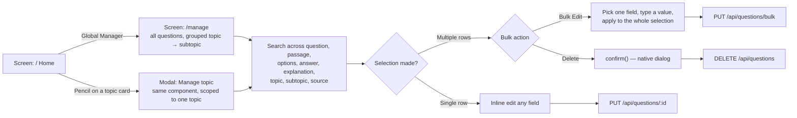

# QuizMaster — Application Flow

> **Version:** 1.4.0  
> **License:** MIT — Copyright © 2026 Shashwat Khare  
> **Last Updated:** 1 August 2026

Every state and decision in the app, as three lanes: ingest a document, play a quiz, manage the bank. The rendered wireframe — screen sketches, decision diamonds and server calls — is at [`assets/quizmaster-application-flow.html`](assets/quizmaster-application-flow.html) (self-contained, pannable).

---

## Table of Contents

1. [Legend](#1-legend)
2. [Lane A — Ingest](#2-lane-a--ingest)
3. [Lane B — Play](#3-lane-b--play)
4. [Lane C — Manage](#4-lane-c--manage)
5. [Cross-Lane Entry Points](#5-cross-lane-entry-points)

---

## 1. Legend

| Shape | Meaning |
|---|---|
| Solid box | A screen or modal the user sees |
| Diamond / red box | A branch in the code |
| Dashed mono box | A server call or background worker step |
| Red note | An entry shortcut — a way into this state that skips the steps before it |

---

## 2. Lane A — Ingest

Document to question bank. `UploadDocumentModal.tsx` · `documentController.js`

```mermaid
flowchart LR
    Home["Screen: / Home"] -->|Upload doc| Modal["Screen: Upload modal"]
    Modal --> D1{"Extension in<br>.txt / .pdf / .docx?"}
    D1 -->|No| Reject["Inline error,<br>stay on modal"]
    D1 -->|Yes| Post["POST /api/upload-document<br>multer memory storage →<br>pdf-parse / mammoth / utf8"]
    Post --> D2{"Any text after stripping<br>page markers?"}
    D2 -->|Yes| TextPath["Text path:<br>numbered lines, 250-line windows,<br>50-line overlap"]
    D2 -->|No| ScanPath["Scan path:<br>pdf-lib cuts 5-page sub-PDFs,<br>inline base64 to vision"]
    TextPath --> Worker
    ScanPath --> Worker["Chunk worker — concurrency 1<br>model ladder from models.list(),<br>scored, rate-limited models skipped"]
    Worker --> D3{"Per chunk:<br>completed / failed / rate_limited"}
    D3 --> Meta["Written to chunksMeta[]<br>with attempt history"]
    Meta -->|Poll 2.5s| Parsing["Screen: Parsing<br>AI is parsing… (Found: n)"]
    Parsing -->|Completed| Review["Screen: Review topics"]
    Review -->|Save| Upsert["POST /api/upload-questions<br>upsert on unique index<br>topic + subtopic + question_text"]
    Upsert --> Home
    Parsing -->|Cancel| Aborted["POST /api/jobs/:id/cancel<br>worker throws JobCancelledError;<br>status stays 'cancelled'"]
```



**Notes**

- The POST returns **202 with a job id** immediately; the worker is detached, so closing the tab does not kill the parse.
- `localStorage.activeUploadJobId` present on mount → the modal auto-opens straight into **Parsing**.
- The worker re-reads job status before every chunk, which is what makes cancellation instant. The cancel path throws a `JobCancelledError` sentinel and the terminal write is guarded on `status: 'processing'`, so a deliberate cancel is never rewritten as a failure.
- Browser traffic is same-origin: `lib/api.ts` calls `/api/*`, which the Next.js server rewrites to `BACKEND_ORIGIN`.
- Upsert against the unique compound index means re-uploading the same document cannot duplicate questions.

---

## 3. Lane B — Play

Configure, answer, score. `QuizConfig` · `QuizEngine` · `Timer` · `ResultsReview` · `quiz-store.ts`

```mermaid
flowchart LR
    Config["Screen: Configure<br>topics · counts · time limit"] --> D1{"At least one<br>topic selected?"}
    D1 -->|No| Disabled["Start Quiz stays disabled"]
    D1 -->|Yes| Gen["POST /api/generate-quiz<br>randomised sample per topic;<br>answerKey returned separately"]
    Gen --> Engine["Screen: Quiz engine<br>Q4 / 10 · 07:12"]
    Engine -->|Timer hits zero| Score
    Engine -->|Submit| D2{"All questions<br>answered?"}
    D2 -->|No| Confirm["Confirm unanswered"]
    D2 -->|Yes| Score["Score against answerKey<br>in the store"]
    Confirm --> Score
    Score --> Results["Screen: Results<br>ring, score, per-question review"]
    Results -->|Take New Quiz → resetQuiz()| Config
```

**Notes**

- The question payload the client renders holds **no correct answer** — the key is a sibling object in the store.
- The timer owns submission: warning at 60s, critical at 30s, auto-submit at zero with no dialog.
- Quiz state is memory-only. A refresh mid-quiz loses the attempt; results are never persisted.

---

## 4. Lane C — Manage

Search, retag, bulk edit, delete. `app/manage/page.tsx` · `QuestionListManager` · `ManageTopicModal.tsx`



**Notes**

- `QuestionListManager` is one component with two entry points — global and topic-scoped.
- Untagged rows are grouped under "Uncategorized in Database" so tagging gaps are visible rather than silent.
- Deletion still uses the browser's native `confirm()` — see the open items in [PRODUCT_PRESENTATION.md](PRODUCT_PRESENTATION.md#9-open-items).

---

## 5. Cross-Lane Entry Points

| From | Trigger | Lands on |
|---|---|---|
| Any load of `/` | `localStorage.activeUploadJobId` set | Upload modal, already in **Parsing** (Lane A) |
| Home | "Global Manager" button | `/manage` (Lane C) |
| Home | Pencil on a topic card | Topic-scoped manager modal (Lane C) |
| Review screen | "Discard & Close" | Back to Home, nothing written |
| Results | "Take New Quiz" | `resetQuiz()` → Configure (Lane B start) |
