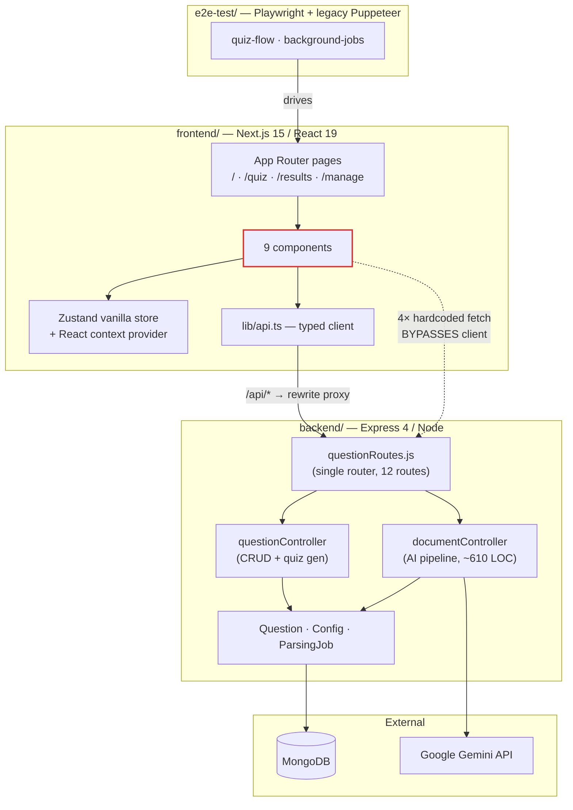
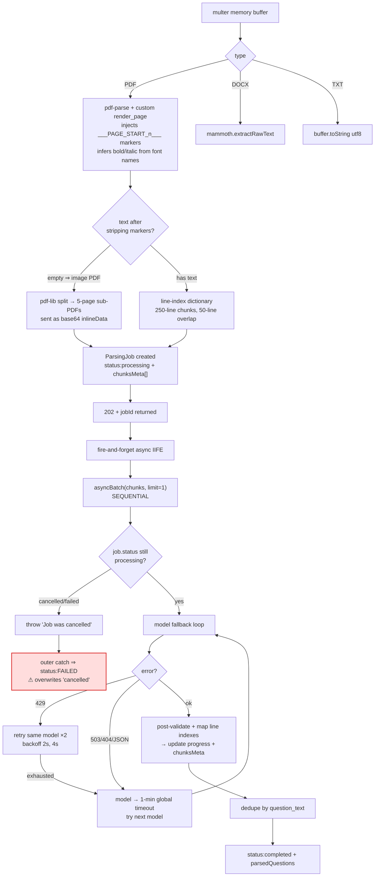
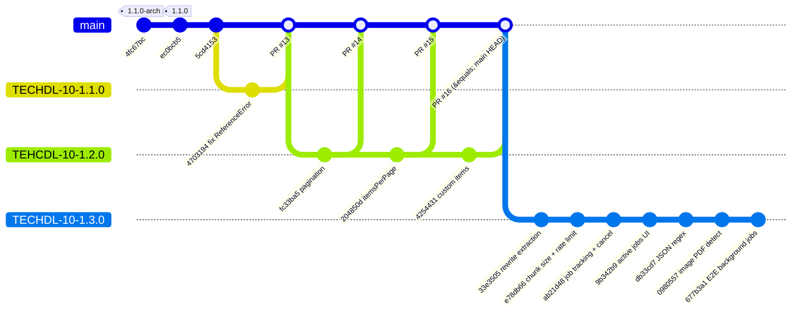

# QuizMaster — Architecture, Findings & Roadmap

> **Audit date:** 1 August 2026
> **Audited ref:** `TECHDL-10-1.3.0` @ `677b3a1` + uncommitted working tree
> **Scope:** Full-repo architecture discovery, branch divergence analysis, and a phased remediation plan.

This document is a **point-in-time engineering audit**. It complements — and does not replace — [TECHNICAL_DOCUMENTATION.md](TECHNICAL_DOCUMENTATION.md) (the living reference) and [USER_MANUAL.md](USER_MANUAL.md) (the end-user guide).

---

## Table of Contents

1. [System Architecture](#1-system-architecture)
2. [Repository Topology](#2-repository-topology)
3. [Branch Divergence Analysis](#3-branch-divergence-analysis)
4. [Findings Register](#4-findings-register)
5. [Phased Remediation Plan](#5-phased-remediation-plan)
6. [Appendix: Verification Commands](#6-appendix-verification-commands)

---

## 1. System Architecture

### 1.1. Shape

QuizMaster is a **three-package polyrepo-in-one-repo** (not a workspaces monorepo — each package has an independent `package.json` and `node_modules`, with no root manifest tying them together).



### 1.2. Layer inventory

| Layer | Location | Notes |
|---|---|---|
| **Entry** | `backend/server.js` | dotenv → `connectDB()` → `app.listen`. Hard-exits on DB failure. |
| **App factory** | `backend/src/app.js` | CORS → `express.json({limit:'10mb'})` → `/health` → `/api` → global error handler. |
| **Routing** | `backend/src/routes/questionRoutes.js` | Single flat router. `/questions/bulk` **must** precede `/questions/:id`; `/jobs/active` **must** precede `/jobs/:jobId`. Both orderings are correct today but undefended by tests. |
| **Controllers** | `questionController.js`, `documentController.js` | No service layer — controllers hold business logic directly. `documentController` is by far the heaviest component. |
| **Models** | `Question`, `Config`, `ParsingJob` | Mongoose. `Question` has a compound unique index `{topic, subtopic, question_text}` for dedup. |
| **State (FE)** | `stores/quiz-store.ts` + provider | Zustand *vanilla* store behind React context — deliberate for Next.js App Router SSR safety. Quiz state is **memory-only** (lost on refresh). |
| **Persistence (FE)** | `localStorage` | Only `activeUploadJobId`. |

### 1.3. The AI parsing pipeline (the architectural centre of gravity)

`documentController.uploadDocument` is a single ~490-line function doing extraction, chunking, job creation, and a fire-and-forget background IIFE. This is the highest-complexity and highest-churn area of the codebase — **every one of the 7 unmerged commits on the current branch touches it.**



**Two prompt strategies coexist:**
- `promptBaseNew` — **semantic router**: text is line-numbered `[N] text`, and the model returns *line indexes* (`question_lines`, `options[].lines`, `explanation_lines`) rather than text. The server reassembles text from its own dictionary. This is a genuinely strong design: it eliminates AI transcription drift and gives free page-number provenance.
- Image PDFs — direct schema with literal text, since there are no line indexes to reference.

`promptBaseOld` remains defined but **unused** (dead code).

**Resilience mechanisms** (all added in the unmerged 1.3.0 work):
- Per-model scored ranking from live `models.list()`, cached 1h, hardcoded fallback list.
- Per-model 429 retry (×2, exponential backoff).
- **Process-global** `Map` of rate-limited models with 1-minute cooldowns, shared across all jobs.
- Per-chunk live telemetry (`chunksMeta[].attemptsHistory`) surfaced to the UI.

### 1.4. Request/data contracts

| Contract | Mechanism | Risk |
|---|---|---|
| **Answer secrecy** | `generateQuiz` strips `correct_answer`/`explanation` into a separate `answerKey` object | Sound in principle, but `answerKey` ships to the client at quiz start — grading is client-side. Adequate for a study tool; **not** exam-grade. |
| **Dedup** | Compound unique index + `bulkWrite` upsert, filter `{topic, subtopic||'General', question_text}` | Sound. |
| **Job polling** | FE polls `GET /api/jobs/:jobId` @2.5s and `GET /api/jobs/active` @ same interval | Works; chatty. No WebSocket/SSE. |
| **Cancellation** | `POST /api/jobs/:id/cancel` sets status; loop re-reads status per chunk | **Broken** — see F-01. |

---

## 2. Repository Topology

```
quiz-app/
├── backend/       Express API        pkg version 1.0.0
├── frontend/      Next.js app        pkg version 0.1.0
├── e2e-test/      Playwright + Puppeteer   pkg version 1.0.0
├── docs/          TECHNICAL_DOCUMENTATION · USER_MANUAL · ai_parsing_explained_simple
├── .agents/       AGENTS.md (workflow rules)
├── README.md · TESTING_GUIDE.md · AI_UPLOAD_FEATURE.md · LICENSE
└── test_job.js · test_upload.txt        ← stray root-level scratch files
```

**Version identity is incoherent across five sources:**

| Source | Value |
|---|---|
| Git tags | `1.0.0`, `1.1.0` |
| Current branch name | `TECHDL-10-1.3.0` |
| `docs/*.md` headers | `1.1.0` |
| `backend/package.json` | `1.0.0` |
| `frontend/package.json` | `0.1.0` |
| `e2e-test/package.json` | `1.0.0` |

A 1.2.0 shipped to `main` (PRs #14–16) but was **never tagged**.

---

## 3. Branch Divergence Analysis



### 3.1. Branch-by-branch state

| Branch | Local HEAD | Remote | Δ vs `main` | Verdict |
|---|---|---|---|---|
| `main` | `dc615da` | in sync | — | Baseline. Ships 1.2.0 (untagged). **Has a red test suite** (see F-04). |
| `TECHDL-10-1.3.0` ⭐ *current* | `677b3a1` | **no upstream — never pushed** | **+7 commits**, all unmerged | Entire background-job/cancellation/resilience feature set exists **only on this machine**. Highest-value, highest-risk state in the repo. |
| `TEHCDL-10-1.2.0` | `4254431` | in sync | **0** — fully merged | Safe to delete. Name contains a **typo** (`TEHCDL` ↔ `TECHDL`) that propagated into 3 merge commit messages. |
| `TECHDL-10-1.1.0` | `4703194` | **behind 1** | **+1 orphaned commit** | `origin/TECHDL-10-1.1.0` holds `06338b7` ("Update README with E2E testing details", 1 line) that **never reached `main`**. Orphaned work. |

### 3.2. Risk concentration

The single most consequential fact in this audit:

> **7 commits and ~464 lines of uncommitted changes — the entire v1.3.0 feature set — exist only in one local working copy, with no remote backup and no PR.**

> [!NOTE]
> **Resolved.** Phase 0 committed the working tree in three slices and pushed
> `TECHDL-10-1.3.0` to `origin`. The paragraph above is retained as the audit-time
> record of why Phase 0 was sequenced first.

Uncommitted working tree at audit time (14 files, +464/−184):
- `backend/src/controllers/documentController.js` (+303/−…) — rate-limit/telemetry rewrite
- `backend/src/models/ParsingJob.js` — `chunksMeta` schema formalisation
- `frontend/src/components/UploadDocumentModal.tsx` (+172) — expandable job/chunk UI
- `frontend/next.config.ts`, `frontend/src/lib/api.ts` — rewrite-proxy migration
- `docs/*` — this session's documentation updates
- Plus untracked: `backend/test-models.js`, `docs/ai_parsing_explained_simple.md`

---

## 4. Findings Register

Severity: **P0** blocks correctness/loss · **P1** breaks quality gates or deploys · **P2** hygiene/consistency · **P3** polish.

### Correctness

| ID | Sev | Finding | Evidence | Impact |
|---|---|---|---|---|
| **F-01** | **P0** | **Cancellation is silently converted to failure.** The chunk loop throws `Error('Job was cancelled')`; the outer `catch` unconditionally writes `{status:'failed', error:'An unexpected error occurred during processing.'}`, overwriting the `cancelled` status the endpoint just set. | `documentController.js:269-271` throws → `:549-555` overwrites | User cancels deliberately, sees a scary generic failure. Cancelled and crashed jobs are indistinguishable in data. |
| **F-02** | **P1** | **4 components bypass the API client with hardcoded `http://localhost:5000`.** These also bypass the new same-origin rewrite proxy, so they are the *only* calls still making cross-origin requests. | `QuestionListManager.tsx:33`, `UploadDocumentModal.tsx:88,91,230` | Guaranteed breakage in any non-local deployment; defeats the purpose of the rewrite migration. |
| **F-03** | **P1** | **Next.js rewrite destination is hardcoded**, not env-driven, while `lib/api.ts` now forces all browser calls through it. | `next.config.ts:4-11` | Frontend server must reach `localhost:5000`. Deployment is currently impossible without a code edit. |

### Quality gates

| ID | Sev | Finding | Evidence | Impact |
|---|---|---|---|---|
| **F-04** | **P1** | **Backend test suite is red on `main` and every branch — 3/20 failing.** `upload-document.test.js` still asserts the *pre-1.1.0 synchronous streaming* contract (`expect(200)`, NDJSON lines, `finalLine.questions`) against an endpoint that has returned `202 {jobId}` since `4fc67bc`. | `npm test` → `Tests: 3 failed, 17 passed` | No trustworthy CI signal. Regressions in the most complex subsystem are invisible. |
| **F-05** | **P1** | The same test's Gemini mock returns the **old flat schema**; the current text path expects the indexed schema (`question_lines`, `options[].lines`). Fixing only the status code would still yield zero parsed questions. | `upload-document.test.js:11-27` | The fix is a rewrite, not a one-liner — budget accordingly. |
| **F-06** | **P2** | **Zero test coverage** for `getActiveJobs`, `cancelJob`, model-fallback/rate-limit logic, chunking, or line-index reassembly — i.e. all of v1.3.0's logic. Only a mocked-network Playwright UI test exists. | `backend/tests/` | The highest-churn code is the least tested. |

### Repository hygiene

| ID | Sev | Finding | Evidence | Impact |
|---|---|---|---|---|
| **F-07** | **P1** | **Unpushed, unbacked-up feature branch** (§3.2). | `git rev-parse @{u}` → *no upstream* | Single point of total work loss. |
| **F-08** | **P2** | **Build/test artifacts are tracked in git**: `frontend/tsconfig.tsbuildinfo`, `e2e-test/playwright-report/**`, `e2e-test/test-results/**` (incl. multi-MB `.webm`). They dirty the tree on every build/test run — 4 of the 12 files in the current diff are artifacts. | `git ls-files`; current `git status` | Noisy diffs, bloated history, merge conflicts on binaries. |
| **F-09** | **P2** | **No `.gitignore` in `frontend/` or `e2e-test/`**; root ignore lacks `*.tsbuildinfo`, `playwright-report/`, `test-results/`. | filesystem | Root cause of F-08. |
| **F-10** | **P2** | **No `.gitattributes`** → every doc/source edit emits `LF will be replaced by CRLF` warnings on this Windows checkout. | every `git diff` in this session | Line-ending churn; spurious whole-file diffs across contributors. |
| **F-11** | **P2** | **Version drift across 6 sources** (§2), and 1.2.0 shipped untagged. | tags vs `package.json` vs docs | No reliable answer to "what version is deployed?" |
| **F-12** | **P3** | Branch-name typo `TEHCDL-10-1.2.0` baked into 3 merge commits on `main`. | `git log` | Cosmetic; breaks ticket-ID search. |
| **F-13** | **P3** | Stray root files `test_job.js`, `test_upload.txt`; untracked `backend/test-models.js`; undocumented `backend/drop-db.js`. | `git ls-files` | Clutter; unclear which scripts are supported. |
| **F-14** | **P3** | Orphaned commit `06338b7` on `origin/TECHDL-10-1.1.0` never merged. | `git log main..origin/TECHDL-10-1.1.0` | 1-line README improvement lost. |

### Documentation accuracy

Verified claim-by-claim against the filesystem:

| ID | Sev | Claim | Reality |
|---|---|---|---|
| **F-15** | **P2** | `README.md` + `TECHNICAL_DOCUMENTATION.md`: run `cd backend && npm run db:cleanup` | **No such script.** Backend has only `start`, `dev`, `test`. Correct command is `cd e2e-test && npm run cleanup`. |
| **F-16** | **P2** | `TECHNICAL_DOCUMENTATION.md` §C: frontend has `test:e2e` script | **Does not exist.** Frontend scripts: `dev build start lint test test:watch`. |
| **F-17** | **P2** | `TECHNICAL_DOCUMENTATION.md` §4: `backend/cleanup-e2e.js` | **Does not exist.** Actual: `e2e-test/scripts/cleanup-e2e.js`. `backend/drop-db.js` exists but is undocumented. |
| **F-18** | **P2** | `TESTING_GUIDE.md`: run `cd e2e-test && npm start` | **No `start` script.** Correct: `npm run test`. |
| **F-19** | **P2** | `TESTING_GUIDE.md`: upload-document endpoint "bulk-upserts into MongoDB" | **False since 1.1.0** — the endpoint only parses; saving is a separate `POST /api/upload-questions` from the review UI. |
| **F-20** | **P2** | `README.md`: demo video at `e2e-test/test-results/demo/e2e-success.webm` | **Path does not exist.** Tracked asset is `e2e-test/quiz_app_demo.mp4`. Video is broken on GitHub. |
| **F-21** | **P3** | `README.md`: "Gemini 1.5 Flash"; "Upload raw text files" | Stale — dynamic model discovery with scored fallback since 1.3.0; PDF/DOCX/image-PDF supported. No mention of background jobs or cancellation in the feature list. |
| **F-22** | **P3** | `AI_UPLOAD_FEATURE.md`: AI returns `Source` in its JSON schema | **False** — `source` is not in either `responseSchema`; it is a user-assigned field in the review UI only. Document is a stale launch-announcement artifact. |

> **Note on scope:** F-15/F-16/F-17 exist in documentation that was updated earlier in this same session. They were inherited from the pre-existing docs and not caught during that pass; they are logged here rather than silently patched so the correction is traceable.

---

## 5. Phased Remediation Plan

Five phases, ordered by *risk retired per unit of effort*. Phases 0–1 are strongly recommended before any further feature work.

> **Status — 1 August 2026.** Phases 0, 1 and 2 are **complete** on `TECHDL-10-1.3.0`.
> Retired: **F-01 – F-09**. The findings register below is preserved as written
> at audit time; consult this block for current state.
> Phases 3–4 remain open. `.gitattributes` (F-10) was *not* pulled forward — it
> stays in Phase 3, so the CRLF warnings persist.
>
> The backend suite went from **17 passed / 3 failed** to **116 passed / 0 failed**
> across 5 files, and CI now runs backend + frontend on every PR.

```mermaid
gantt
    dateFormat X
    axisFormat %s
    title Remediation sequencing (relative effort units)
    section P0 Secure
    Push branch + PR           :p0, 0, 1
    section P1 Correctness
    Fix cancellation bug       :p1a, 1, 2
    Centralise API base URL    :p1b, 1, 2
    section P2 Gates
    Rewrite upload tests       :p2a, 3, 3
    Cover jobs API             :p2b, 3, 3
    section P3 Hygiene
    gitignore + attributes     :p3, 6, 2
    section P4 Standardise
    Versioning + docs truth    :p4, 8, 3
```



---

### Phase 0 — Secure the work *(do first, today)*

**Retires:** F-07 · **Effort:** minutes · **Risk if skipped:** total loss of v1.3.0

The uncommitted tree contains real feature work plus this session's doc updates. Commit in coherent slices, then push.

1. Add ignore rules **before** committing (Phase 3's `.gitignore` work, pulled forward) so artifacts don't enter this commit.
2. Untrack existing artifacts: `git rm --cached` for `tsbuildinfo`, `playwright-report/`, `test-results/`.
3. Commit remaining work in two slices — (a) backend rate-limit/telemetry + model changes, (b) frontend job UI + rewrite-proxy migration + docs.
4. `git push -u origin TECHDL-10-1.3.0` and open the PR.

Per `.agents/AGENTS.md`, confirm the PR title prefix before raising it.

---

### Phase 1 — Correctness fixes *(before merging 1.3.0)*

**Retires:** F-01, F-02, F-03

**1a. Fix cancellation status overwrite (F-01) — P0**
Distinguish deliberate cancellation from failure. Use a sentinel rather than a string match:

```js
class JobCancelledError extends Error {}
// throw new JobCancelledError() at the chunk-loop guard
// in the outer catch:
if (error instanceof JobCancelledError) return;   // status already 'cancelled'
```

Guard the terminal write so it can never demote a terminal state: `findOneAndUpdate({_id, status:'processing'}, {...})`.

**1b. Centralise the API base URL (F-02, F-03)**
Replace all 4 hardcoded `fetch('http://localhost:5000/...')` calls with `lib/api.ts` functions (add `fetchSources()` / reuse `fetchTopics()` / `uploadQuestions()`). Then make the rewrite destination env-driven:

```ts
destination: `${process.env.BACKEND_ORIGIN ?? 'http://localhost:5000'}/api/:path*`
```

Document `BACKEND_ORIGIN` in `.env.example` and the technical doc. **Decision needed:** keep the rewrite-proxy model (simpler CORS, requires the FE server to reach the BE) or revert to direct `NEXT_PUBLIC_API_URL` calls. The proxy is the better default for containerised deploys; flag this explicitly rather than leaving it implicit.

---

### Phase 2 — Restore the quality gate

**Retires:** F-04, F-05, F-06 · **Prerequisite for trusting any future change**

1. **Rewrite `upload-document.test.js`** for the async contract: assert `202` + `jobId`, then poll/await the `ParsingJob` document to reach a terminal state. Update the Gemini mock to the **indexed** schema (`question_lines`, `options[].lines`, `explanation_lines`) so the line-reassembly path is actually exercised.
2. **Add `jobs.test.js`**: `GET /jobs/active` filtering & ordering; `POST /jobs/:id/cancel` happy path, 404, and 400-on-terminal; and a regression test asserting **a cancelled job stays `cancelled`** (locks in F-01).
3. **Add unit coverage for pure logic** — extract and test `getScore()` model ranking, the chunker (250/50 overlap, page-range derivation), and the line-index reassembly. These are deterministic and cheap to test.
4. **Add route-ordering tests** for `/questions/bulk` vs `/:id` and `/jobs/active` vs `/:jobId` — currently correct but one careless reorder from silent breakage.
5. Only once green: wire CI (GitHub Actions) running backend + frontend tests on PR.

---

### Phase 3 — Repository hygiene

**Retires:** F-08, F-09, F-10, F-13, F-14

1. **`frontend/.gitignore`**: `.next/`, `*.tsbuildinfo`, `node_modules/`, `.env*.local`
2. **`e2e-test/.gitignore`**: `playwright-report/`, `test-results/`, `node_modules/`
3. **`.gitattributes`** at root — `* text=auto eol=lf` plus `-text` for `*.webm *.mp4 *.png *.pdf *.docx`. Ends the CRLF churn (F-10).
4. `git rm --cached` all currently-tracked artifacts (F-08).
5. Decide the fate of the demo video: keep **one** canonical asset, fix the README path (F-20), and ignore the rest.
6. Remove/relocate stray scripts (F-13): delete `test_job.js` + `test_upload.txt`; move `test-gemini.js`, `test-models.js`, `test_pdf_bold.js`, `drop-db.js` into `backend/scripts/` and document them.
7. Cherry-pick orphaned `06338b7` onto the 1.3.0 branch, then delete merged branches `TEHCDL-10-1.2.0` and `TECHDL-10-1.1.0` locally and on origin (F-14, F-12).

---

### Phase 4 — Standardisation

**Retires:** F-11, F-15 … F-22

1. **Single source of version truth.** Pick one scheme — recommend: git tag is canonical, all three `package.json` versions match it, docs carry the same number. Reconcile `frontend` `0.1.0` → real version. **Backfill the `1.2.0` tag** on `dc615da`. Tag `1.3.0` at the 1.3.0 merge.
2. **Fix every documentation claim in F-15 … F-22** in one pass — these are cheap, and each one currently sends a reader to a command that fails.
3. **Consolidate the doc set.** Five top-level markdown files with overlapping, drifting scope is the root cause of F-15–F-22. Recommend: `README.md` (orientation + quickstart only, links out), `docs/` (technical, user, architecture, parsing-explainer). Fold `TESTING_GUIDE.md` into the technical doc's §8 and retire `AI_UPLOAD_FEATURE.md` (a launch announcement, now actively wrong per F-22).
4. **Encode the doc-sync rule.** `.agents/AGENTS.md` already mandates updating `ai_parsing_explained_simple.md` whenever the parsing mechanism changes. Extend it to the technical doc's API reference + schema tables, and add a PR checklist item. Documentation drift here is systemic, not incidental.
5. **Standardise branch naming** — `TECHDL-<n>-<semver>` — and add the typo class to the checklist (F-12).

---

### Deferred / explicitly out of scope

Recorded so they are not rediscovered later:

- **Client-side grading** (§1.4). The `answerKey` reaches the browser at quiz start. Fine for a personal study tool; would need server-side grading for any assessment use.
- **No auth on any route.** Every endpoint is unauthenticated, including destructive bulk delete. Acceptable for localhost single-user; a hard blocker for shared hosting.
- **In-memory rate-limit `Map`** does not survive restarts and is per-process — incorrect under multi-instance deploys. Would need Redis or a DB-backed store to scale out.
- **Polling over SSE/WebSocket** — two 2.5s pollers per open modal. Works; revisit only if job volume grows.
- **`documentController` decomposition** — ~610 LOC in one file with a ~490-line handler. Splitting extraction / chunking / AI-client / job-orchestration into modules would make Phase 2's unit tests far easier. Sequence it *after* tests exist, not before.

---

## 6. Appendix: Verification Commands

Every finding above is reproducible:

```bash
git log --oneline main..HEAD && git rev-parse --abbrev-ref '@{u}'
```

```bash
git log --oneline main..origin/TECHDL-10-1.1.0
```

```bash
cd backend && npm test
```

```bash
git ls-files | grep -E 'tsbuildinfo|playwright-report|test-results'
```

```bash
grep -rn "localhost:5000" frontend/src
```

```bash
node -e "console.log(require('./backend/package.json').scripts)"
```
