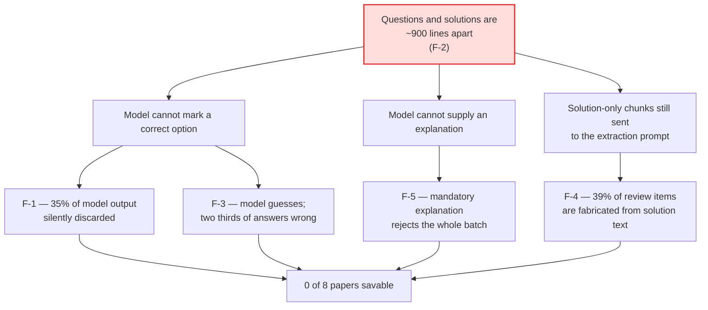

# QuizMaster — Parsing Accuracy Remediation Plan

> **Version:** 1.4.0
> **License:** MIT — Copyright © 2026 Shashwat Khare
> **Created:** 5 August 2026
> **Driven by:** the upload/parsing test run of 4 August 2026 — 8 SBI PO Prelims papers, 800 questions
> **Tracking issue:** [#32](https://github.com/shshwtkhr/quiz-app/issues/32)

This document plans the remediation of the **document-parsing pipeline**. It is
scoped to extraction quality and the model layer; it does not revisit the
architecture audit in
[ARCHITECTURE_AND_ROADMAP.md](ARCHITECTURE_AND_ROADMAP.md), whose five phases
are complete.

> [!NOTE]
> Phase status lives in the GitHub issues, not here. Where this document and
> [#32](https://github.com/shshwtkhr/quiz-app/issues/32) disagree about what is
> done, believe the issues.

---

## Table of Contents

1. [The Result](#1-the-result)
2. [Root Cause](#2-root-cause)
3. [Cost Analysis](#3-cost-analysis)
4. [Free Tier vs Paid Tier](#4-free-tier-vs-paid-tier)
5. [Model Provider Comparison](#5-model-provider-comparison)
6. [Phased Plan](#6-phased-plan)
7. [How Progress Is Measured](#7-how-progress-is-measured)

---

## 1. The Result

Eight papers, each containing exactly 100 questions, uploaded through the real
API and polled exactly as the frontend does.

| Measure | Value |
|---|---|
| Papers that could be saved to the question bank | **0 of 8** |
| Questions recovered | 361 of 800 — **45 %** |
| Items reaching review that were **not** questions | 235 — **39 %** |
| Surviving answers that were **correct** | 165 of 363 — **45 %** |
| Wall-clock for the run | **4 h 53 min** |
| Token cost, had billing been enabled | **$0.26** |

Per-paper coverage ranged from 30 % to 63 % and answer accuracy from 22 % to
71 %, **with no property of the input predicting either**. The same file run
twice produced 33 items and then 79 — yield is not reproducible between runs.

**What works.** Upload, job creation, polling, live per-chunk progress,
background continuation, resume from `localStorage`, cancellation and the review
UI were all exercised successfully and behaved as documented. The 202-plus-jobId
contract, the telemetry and the cancellation guard added in Phases 0–2 of the
architecture remediation all held up.

**What does not.** Extraction.

---

## 2. Root Cause

One design assumption underpins the whole pipeline:

> *A question and its answer appear near each other in the text.*

For this corpus that is false, and not marginally so. These papers place all 100
questions first and all solutions afterwards:

| Paper | Q1 → its solution | Chunk window |
|---|---|---|
| 2025 4-Aug 1st | 1,094 lines | 250 |
| 2025 4-Aug 2nd | 1,106 lines | 250 |
| 8-Mar 1st | 912 lines | 250 |
| 8-Mar 2nd | 872 lines | 250 |
| 8-Mar 3rd | 886 lines | 250 |

**0 of 9 checked questions had their solution in the same chunk.** The 50-line
overlap solves a question straddling a boundary; it does nothing for a 900-line
separation.

Everything else follows from this:

The pipeline's response to the assumption being violated is to **discard the
questions silently and report success** — chunk 0 of paper 1 returned 18
well-formed questions, dropped all 18, and displayed a green tick reading
*"Success: Found 0 questions"*.

---

## 3. Cost Analysis

Token volume is derived from the run rather than estimated: 18,773 lines sent
across 81 successful calls (250-line windows on a 200-line stride, so **23.3 %
overlap overhead**), and 1,279 returned objects.

- **≈ 270 K input tokens**
- **≈ 70 K output tokens**

for all eight papers — 800 questions.

| Model | $/1M in | $/1M out | Whole run | Per paper | Per 1,000 questions kept |
|---|---|---|---|---|---|
| `gemini-2.5-flash-lite` | $0.10 | $0.40 | **$0.055** | $0.007 | $0.15 |
| `gemini-2.5-flash` | $0.30 | $2.50 | **$0.257** | $0.032 | $0.71 |
| `gemini-2.5-pro` | $1.25 | $10.00 | $1.041 | $0.130 | $2.87 |

The **1,520 rate-limited attempts cost nothing** — 429 and 404 responses are
rejected before token processing. They cost wall-clock, not money.

> [!IMPORTANT]
> The 4 h 53 min run represents **$0.26 of tokens**. The first two papers took
> 7.9 and 5.2 minutes; the remaining six took 31–56 minutes each for the same
> work, entirely because free-tier quota was exhausted and the pipeline spent
> the rest of the run collecting 429s.
>
> **This was a quota problem, not a cost problem.** Cost is not a meaningful
> constraint on this workload at any credible price point.

---

## 4. Free Tier vs Paid Tier

Checked against Google's own documentation, because the run's behaviour raised
the question of whether the free tier serves a degraded model.

| | Free tier | Paid tier |
|---|---|---|
| **Rate limits** | Low; exhausted by ~3 papers | Substantially higher, rising by tier |
| **Token cost** | Free of charge | Per the table in §3 |
| **Data usage** | Prompts and responses **may be used to improve Google products** | **Not** used to improve Google products |
| **Model availability** | Some advanced models are paid-only | All |
| **Model quality, latency, priority, SLA** | *Not documented as differing* | *Not documented as differing* |

**Answer to the question that prompted this section:** for the same model, the
documented differences are **quota, data-usage policy and model availability**.
Nothing in the documentation indicates the free tier serves a degraded model,
lower priority, or worse latency per request. The collapse in throughput observed
in the run is fully explained by rate limiting.

The data-usage difference deserves its own weight here: this corpus is
**copyrighted exam material**, and on the free tier it may be used to improve
Google products.

Sources: [pricing](https://ai.google.dev/gemini-api/docs/pricing) ·
[billing](https://ai.google.dev/gemini-api/docs/billing) ·
[rate limits](https://ai.google.dev/gemini-api/docs/rate-limits)

---

## 5. Model Provider Comparison

Evaluated at the measured workload of §3. Full discussion in
[#2](https://github.com/shshwtkhr/quiz-app/issues/2).

| Provider / model | $/1M in | $/1M out | **Whole run** | Structured output | Verdict |
|---|---|---|---|---|---|
| Amazon Nova Lite (Bedrock) | $0.06 | $0.24 | **$0.033** | tool-use / JSON | Cheapest; new SDK and IAM surface |
| **Gemini 2.5 Flash-Lite** | $0.10 | $0.40 | **$0.055** | native `responseSchema` | Already integrated |
| Claude Haiku 4.5 (Bedrock) | $0.25 | $1.25 | **$0.155** | tool-use | Strongest small-model extraction |
| **Gemini 2.5 Flash** *(current)* | $0.30 | $2.50 | **$0.257** | native `responseSchema` | Current default |
| HF Inference Providers | from ~€0.04 | varies | ~$0.02–0.10 | varies by provider | Fragmented; per-provider capabilities |
| Local / self-hosted | — | — | $0 + hardware | grammar-constrained | **Not viable — see below** |

**The entire spread between the cheapest and most expensive credible option is
about $0.22 per eight papers.** Provider choice cannot be justified on cost.

### Local / self-hosted is not viable on the current host

Measured, not assumed:

- **15.8 GB RAM total, 1.4 GB free**
- **GPU: NVIDIA MX130, 2 GB VRAM**

2 GB of VRAM cannot hold a model worth using for structured extraction, and CPU
inference needs several GB that are not available. This is not hypothetical — the
test run recorded **`mongod` being OOM-killed mid-suite**, taking the backend
with it and orphaning a job permanently. Adding a local model to this host would
make that worse.

Revisit only on different hardware, and then for **privacy and offline
capability**, not cost.

### What would justify multi-provider

1. **Extraction accuracy — the primary driver.** Quality varies materially
   between models, and that variance decides whether a parsed paper is usable at
   all. Per-paper answer accuracy ranged **22 % to 71 %** across the corpus, and
   the paper that ran mostly on Gemma scored lowest:

   | Paper | Models that did the work | Answer accuracy |
   |---|---|---|
   | 1 | `gemini-2.5-flash`, `2.5-flash-lite`, `gemma-4-26b` | 41 % |
   | 2 | `gemini-2.5-flash-lite`, `gemma-4-26b` | 35 % |
   | 3 | mostly `gemma-4-26b` / `gemma-4-31b` | **22 %** |

   The ladder made that substitution silently — `getScore` awards Gemma **10**
   on no pattern match plus the stable bonus, so the weakest model in the pool
   became the workhorse once quota ran out.

   > **The honest caveat:** this data cannot cleanly attribute the variance to
   > the model. The dominant cause of wrong answers was structural (§2), sample
   > sizes per model are small, and the papers differ. The conclusion is not
   > *"Gemma is bad"* — it is that **we select models by name-matching heuristic,
   > with no measurement, and the observed spread is large enough to matter.**
   > That is what [#34](https://github.com/shshwtkhr/quiz-app/issues/34) exists
   > to fix, and why it must precede any provider adoption.

2. **Quota headroom** — the operational failure in this run. Enabling billing is
   the cheaper first answer.
3. **Vendor independence** — today a Google outage stops the product.
4. **Data policy** — see §4.
5. ~~Cost~~ — not a factor. The entire spread is ~$0.22 per eight papers.

> [!WARNING]
> **Sequence matters here.** Do not adopt a new provider before the two-pass
> work lands — a better model cannot supply an answer that sits 900 lines
> outside its context window, so measuring models first would measure the
> structural problem, not the models. And do not adopt one before the
> evaluation harness exists either: a provider abstraction without measurement
> only adds more unmeasured choices.
>
> Order: [#27](https://github.com/shshwtkhr/quiz-app/issues/27) structure →
> [#34](https://github.com/shshwtkhr/quiz-app/issues/34) measurement →
> [#2](https://github.com/shshwtkhr/quiz-app/issues/2) providers.

Sources: [Bedrock pricing](https://aws.amazon.com/bedrock/pricing/) ·
[Nova pricing](https://aws.amazon.com/nova/pricing/) ·
[HF Inference Providers pricing](https://huggingface.co/docs/inference-providers/pricing)

---

## 6. Phased Plan

Ordered by risk retired per unit of effort. Each phase is independently
shippable. Tracking: [#32](https://github.com/shshwtkhr/quiz-app/issues/32).

### Phase 0 — Unblock throughput · no code

| Issue | Work |
|---|---|
| [#23](https://github.com/shshwtkhr/quiz-app/issues/23) | Enable Gemini API billing, behind a monthly spend cap |

The 4.9-hour run was $0.26 of tokens. This is the cheapest and fastest
improvement available and requires no change to the codebase.

**Set a spend cap first.** Google Cloud spend caps are a hard stop, not just an
alert — at 100 % of target, "usage of your specified services is automatically
paused until you *manually* lift the spend cap". Gemini API is an eligible
service, and a cap can be scoped to a single project from AI Studio
(*Spend* → *Monthly spend cap*). Alerts fire at 50 % and 80 %.

| Cap | Headroom at Flash pricing |
|---|---|
| **$5/month** | ~19 full 8-paper runs — recommended |
| $10/month | ~39 runs |
| $1/month | ~4 runs — tight, but a genuine hard stop |

Caveats worth knowing: enforcement uses *estimated* gross cost and is not
instant, so slight overage is billed as normal; in-flight requests complete;
and once tripped the cap must be lifted manually, which stops parsing until
someone acts.

> Set the cap **before** enabling billing. The unbounded retry loop in
> [#28](https://github.com/shshwtkhr/quiz-app/issues/28) — one chunk accumulated
> 28 failed attempts — is exactly the failure mode a cap protects against, and
> it is not fixed yet.

### Phase 1 — Stop the silent loss · small, high value

| Issue | Work |
|---|---|
| [#24](https://github.com/shshwtkhr/quiz-app/issues/24) | Keep questions with no correct option; mark `needs_answer` **(P0)** |
| [#25](https://github.com/shshwtkhr/quiz-app/issues/25) | Stop reporting "Success: Found 0 questions" after discarding valid output |
| [#26](https://github.com/shshwtkhr/quiz-app/issues/26) | Allow save without an explanation; per-item validation **(P0 — the end-to-end blocker)** |

After Phase 1 a paper can reach the question bank at all, even if answers still
need human input.

### Phase 2 — Fix the root cause

| Issue | Work |
|---|---|
| [#27](https://github.com/shshwtkhr/quiz-app/issues/27) | Two-pass parsing — segment questions from solutions, join on question number, skip solution-only chunks |

The only change that can lift coverage above ~50 % and cut the 39 % junk rate.
It also reduces cost and time, because solution-only chunks stop being sent to
the extraction prompt — on paper 1 that is 7 of 13 calls.

### Phase 3 — Ladder hygiene

| Issue | Work |
|---|---|
| [#28](https://github.com/shshwtkhr/quiz-app/issues/28) | Exclude `flash-image`, circuit-break failing models, per-chunk attempt budget, per-request timeout |

### Phase 4 — Resolve what the document cannot answer

| Issue | Work |
|---|---|
| [#29](https://github.com/shshwtkhr/quiz-app/issues/29) | Web-search fallback for `needs_answer` questions, with provenance and a confidence gate |

Scoped to what Phase 2 **cannot** recover: papers uploaded without solutions,
failed joins, low-confidence results. Runs only on `needs_answer` questions,
never on the happy path.

Three constraints are non-negotiable: **provenance** (`answerSource` and source
URLs stored and shown), a **confidence gate** (replacing a wrong AI answer with a
differently-wrong web answer is not progress), and **offline measurement against
the known keys before it is enabled by default**. Search results for exam
questions are frequently other people's wrong answers.

### Phase 5 — Measure, then diversify

| Issue | Work |
|---|---|
| [#34](https://github.com/shshwtkhr/quiz-app/issues/34) | Per-model evaluation harness — pin a model, score it against the known keys |
| [#2](https://github.com/shshwtkhr/quiz-app/issues/2) | Additional model providers — re-scoped, see §5 |

In that order. Model choice is currently a name-matching heuristic with no
measurement behind it; #34 is what makes the provider decision an evidence-based
one rather than another guess.

### Phase 6 — Robustness and polish

| Issue | Work |
|---|---|
| [#30](https://github.com/shshwtkhr/quiz-app/issues/30) | 400 for malformed job ids; validate `correct_answer ∈ options` on save |
| [#31](https://github.com/shshwtkhr/quiz-app/issues/31) | Topic vocabulary normalisation — one paper produced 14 near-synonym topics |
| [#22](https://github.com/shshwtkhr/quiz-app/issues/22) | Durable jobs / orphan reaping — already open; the run reproduced it |

---

## 7. How Progress Is Measured

Re-run the same eight-paper corpus after each phase and compare against the
4 August baseline. Anything else is opinion.

| | Baseline (4 Aug) | Target |
|---|---|---|
| Papers savable | 0 / 8 | 8 / 8 |
| Coverage | 45 % | > 90 % |
| Junk rate | 39 % | < 5 % |
| Answer accuracy | 45 % | > 95 % |
| Wall-clock | 4 h 53 min | < 30 min |

### Known gap in the evidence

**The image-PDF / vision path was never exercised** — all eight papers were text
PDFs. Its accuracy is unknown, and no finding in this plan covers it.
[#1](https://github.com/shshwtkhr/quiz-app/issues/1) (scan-to-text) is in the
same area. A comparable run against scanned papers is needed before any claim is
made about that path.

### Artefacts

The full report and its machine-readable artefacts live in
`e2e-test/test-results/upload-parsing-2026-08-04/` — per-paper results, raw job
records, independently derived ground truth, the API edge-case checks, and the
full parsed output for each paper.

> That directory is **gitignored**, so it is local to the machine that ran the
> tests. The report's §6 describes the harnesses so the run can be reproduced.
