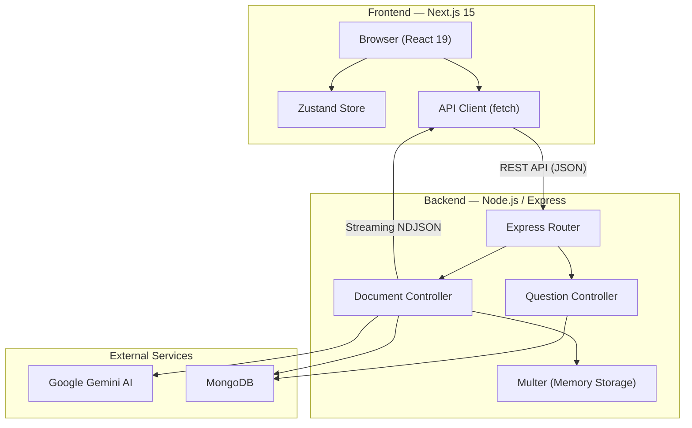
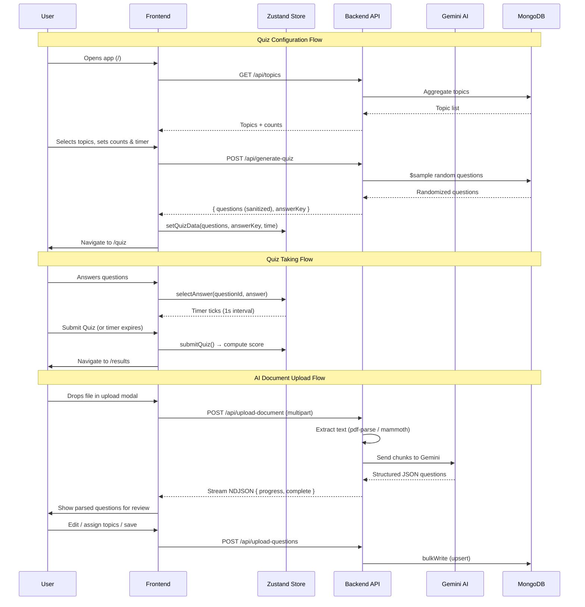
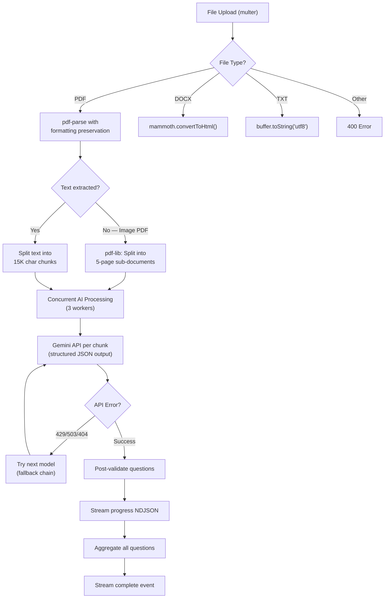
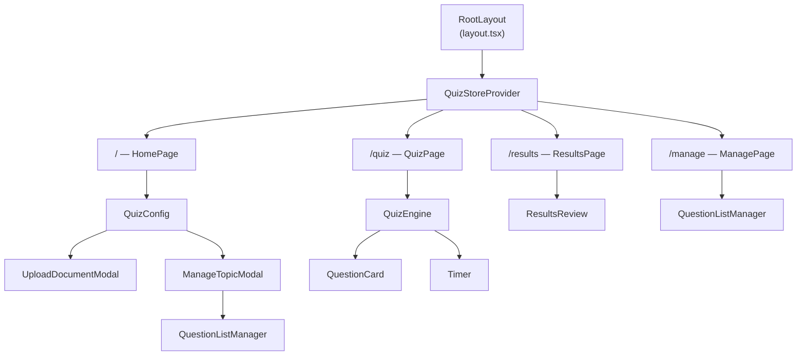
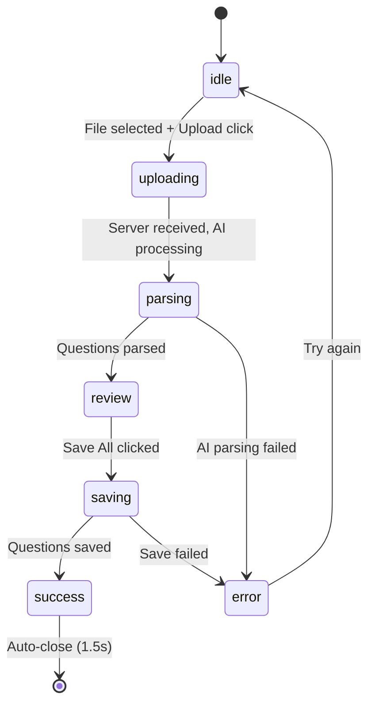

# QuizMaster — Technical Documentation

> **Version:** 1.0.0  
> **License:** MIT — Copyright © 2026 Shashwat Khare  
> **Last Updated:** July 2026

---

## Table of Contents

1. [System Overview](#1-system-overview)
2. [Architecture](#2-architecture)
3. [Technology Stack](#3-technology-stack)
4. [Project Structure](#4-project-structure)
5. [Backend](#5-backend)
   - [Entry Point & Server Startup](#51-entry-point--server-startup)
   - [Express Application Factory](#52-express-application-factory)
   - [Database Configuration](#53-database-configuration)
   - [Data Models](#54-data-models)
   - [API Reference](#55-api-reference)
   - [Document Processing Pipeline](#56-document-processing-pipeline)
   - [Error Handling](#57-error-handling)
6. [Frontend](#6-frontend)
   - [Routing & Page Guards](#61-routing--page-guards)
   - [Component Architecture](#62-component-architecture)
   - [State Management (Zustand)](#63-state-management-zustand)
   - [TypeScript Type System](#64-typescript-type-system)
   - [API Client](#65-api-client)
   - [Design System](#66-design-system)
7. [Environment Configuration](#7-environment-configuration)
8. [Testing](#8-testing)
9. [Build & Deployment](#9-build--deployment)
10. [Appendices](#10-appendices)

---

## 1. System Overview

QuizMaster is a full-stack quiz application that combines manual question management with AI-powered document parsing. Users can upload PDF, DOCX, or TXT files and let Google's Gemini AI automatically extract structured quiz questions — complete with topics, subtopics, options, answers, and explanations. The application also supports manual question CRUD, dynamic quiz generation with configurable parameters, timed quiz-taking, and detailed results review.

### Key Capabilities

| Capability | Description |
|---|---|
| **AI Document Parsing** | Upload documents → Gemini AI extracts structured questions with topics, subtopics, and explanations |
| **Smart Formatting** | Preserves markdown bold/italic formatting from source PDFs |
| **Streaming Progress** | Real-time NDJSON streaming during AI processing with progress indicators |
| **Question Management** | Full CRUD operations: create, search, inline-edit, bulk-delete, grouped views |
| **Dynamic Quiz Generation** | Select topics, set question counts per topic, configure time limits |
| **Timed Quiz Engine** | Sequential question navigation, countdown timer, auto-submit on timeout |
| **Results Analytics** | Score percentage, circular progress ring, per-question detailed review |

---

## 2. Architecture

### High-Level Architecture



### Data Flow



### Design Principles

1. **Separation of Concerns** — Entry point → App factory → Routes → Controllers → Models
2. **Answer Security** — Quiz generation strips answers from questions; answers sent in a separate `answerKey` object
3. **Deduplication** — Compound unique index on `{ topic, subtopic, question_text }` prevents duplicate questions
4. **Streaming for UX** — Long-running AI operations use NDJSON streaming for real-time progress
5. **AI Model Resilience** — Dynamic model discovery with scoring, sorting, and automatic fallback on rate limits
6. **SSR-Safe State** — Zustand vanilla store + React context provider pattern for Next.js App Router compatibility

---

## 3. Technology Stack

### Frontend

| Technology | Version | Purpose |
|---|---|---|
| Next.js | 15.1.0 | React meta-framework with App Router |
| React | 19.0.0 | UI component library |
| TypeScript | ^5 | Static type checking |
| Tailwind CSS | ^4.0.0 | Utility-first CSS framework |
| Zustand | ^5.0.0 | Lightweight state management |
| Lucide React | ^1.22.0 | Icon library |
| React Markdown | ^10.1.0 | Markdown rendering |
| Playwright | ^1.61.1 | E2E browser testing |
| Jest | ^29.7.0 | Unit testing |
| Testing Library | ^16.0.0 | Component testing utilities |

### Backend

| Technology | Version | Purpose |
|---|---|---|
| Node.js | — | JavaScript runtime |
| Express | ^4.21.0 | HTTP server framework |
| Mongoose | ^8.7.0 | MongoDB ODM |
| @google/genai | ^2.10.0 | Google Gemini AI SDK |
| multer | ^2.2.0 | Multipart form data handling |
| pdf-parse | ^1.1.1 | PDF text extraction |
| pdf-lib | ^1.17.1 | PDF document manipulation (splitting image PDFs) |
| mammoth | ^1.12.0 | DOCX to HTML conversion |
| dotenv | ^16.4.5 | Environment variable loading |
| cors | ^2.8.5 | Cross-Origin Resource Sharing |
| Jest | ^29.7.0 | Backend testing |
| Supertest | ^7.0.0 | HTTP assertion library |
| mongodb-memory-server | ^10.0.0 | In-memory MongoDB for testing |

---

## 4. Project Structure

```
quiz-app/
├── backend/
│   ├── src/
│   │   ├── app.js                    # Express app factory
│   │   ├── config/
│   │   │   └── db.js                 # MongoDB connection helper
│   │   ├── controllers/
│   │   │   ├── questionController.js # Question CRUD + quiz generation
│   │   │   └── documentController.js # AI document parsing pipeline
│   │   ├── models/
│   │   │   ├── Question.js           # Question schema & model
│   │   │   └── Config.js             # Key-value config model
│   │   └── routes/
│   │       └── questionRoutes.js     # Route definitions + multer
│   ├── tests/
│   │   ├── api.test.js               # Core API route tests
│   │   ├── upload-document.test.js   # AI upload endpoint tests
│   │   └── helpers/
│   │       ├── db.js                 # In-memory MongoDB setup/teardown
│   │       └── setup.js              # Test environment setup
│   ├── server.js                     # Entry point
│   ├── seed_config.js                # API key seeding script
│   ├── cleanup-e2e.js                # E2E test data cleanup
│   ├── jest.config.js                # Jest configuration
│   ├── package.json
│   ├── .env.example
│   └── .env
│
├── frontend/
│   ├── src/
│   │   ├── app/
│   │   │   ├── layout.tsx            # Root layout (fonts, providers)
│   │   │   ├── globals.css           # Theme tokens + utility classes
│   │   │   ├── page.tsx              # Home page → QuizConfig
│   │   │   ├── quiz/page.tsx         # Quiz page (guarded)
│   │   │   ├── results/page.tsx      # Results page (guarded)
│   │   │   └── manage/page.tsx       # Global question manager
│   │   ├── components/
│   │   │   ├── QuizConfig.tsx        # Topic selection & quiz setup
│   │   │   ├── QuizEngine.tsx        # Quiz-taking engine
│   │   │   ├── QuestionCard.tsx      # Single question display
│   │   │   ├── Timer.tsx             # Countdown timer
│   │   │   ├── ResultsReview.tsx     # Post-quiz results & review
│   │   │   ├── QuestionListManager.tsx  # Reusable question CRUD list
│   │   │   ├── UploadDocumentModal.tsx  # AI document upload modal
│   │   │   └── ManageTopicModal.tsx  # Per-topic management modal
│   │   ├── stores/
│   │   │   ├── quiz-store.ts         # Zustand store definition
│   │   │   └── quiz-store-provider.tsx # React context provider
│   │   ├── types/
│   │   │   └── index.ts             # TypeScript type definitions
│   │   └── lib/
│   │       ├── api.ts               # API client functions
│   │       └── formatText.tsx       # Markdown text formatter
│   ├── __tests__/
│   │   └── QuizEngine.test.tsx      # Component unit tests
│   ├── e2e/
│   │   ├── quiz-flow.spec.ts        # Playwright E2E tests
│   │   └── test-files/              # Test fixture files
│   ├── playwright.config.ts
│   ├── jest.config.ts
│   ├── jest.setup.ts
│   ├── next.config.ts
│   ├── tsconfig.json
│   ├── postcss.config.mjs
│   └── package.json
│
├── e2e-test/
│   ├── record.js                    # Puppeteer visual E2E recorder
│   ├── test-comprehension.js        # Comprehension flow test
│   ├── test-volume.js               # Volume testing
│   ├── test-files/                  # Test fixture files
│   └── package.json
│
├── .gitignore
├── README.md
├── AI_UPLOAD_FEATURE.md
├── TESTING_GUIDE.md
└── LICENSE
```

---

## 5. Backend

### 5.1. Entry Point & Server Startup

[server.js](file:///e:/Projects/quiz-app/backend/server.js) is the application entry point:

1. Loads environment variables via `dotenv`
2. Imports the Express app and the database connector
3. Awaits MongoDB connection via `connectDB()`
4. Starts the HTTP server on the configured `PORT` (default: `5000`)
5. Logs a startup message with health-check URL

```javascript
// Simplified startup flow
require('dotenv').config();
const app = require('./src/app');
const connectDB = require('./src/config/db');

(async () => {
  await connectDB();
  app.listen(PORT, () => console.log(`Server running on port ${PORT}`));
})();
```

### 5.2. Express Application Factory

[app.js](file:///e:/Projects/quiz-app/backend/src/app.js) configures the Express application:

**Middleware Stack (in order):**

| Order | Middleware | Configuration |
|---|---|---|
| 1 | `cors()` | Origin: `CORS_ORIGIN` env var (default `'*'`), Methods: `GET, POST, PUT, DELETE` |
| 2 | `express.json()` | Body size limit: `10mb` |
| 3 | Routes | All `/api/*` routes → `questionRoutes` |
| 4 | Health check | `GET /health` → `{ status: 'ok', timestamp }` |
| 5 | Global error handler | 4-argument middleware, returns `500` with error details in development |

### 5.3. Database Configuration

[db.js](file:///e:/Projects/quiz-app/backend/src/config/db.js) provides the `connectDB()` function:

- Connects to MongoDB using the `MONGODB_URI` environment variable
- Logs the connected host on success
- **Hard exits** (`process.exit(1)`) on connection failure — this is intentional for deployment environments where a missing database should prevent startup

### 5.4. Data Models

#### Question Model

[Question.js](file:///e:/Projects/quiz-app/backend/src/models/Question.js) — The core data model for quiz questions.

**Schema:**

| Field | Type | Required | Validation | Indexing |
|---|---|---|---|---|
| `topic` | `String` | ✅ | `trim: true` | Single-field index |
| `subtopic` | `String` | ❌ | `trim: true` | Single-field index |
| `context` | `String` | ❌ | `trim: true` | — |
| `question_text` | `String` | ✅ | `trim: true` | Part of compound unique index |
| `options` | `[String]` | ✅ | Min 2 items | — |
| `correct_answer` | `String` | ✅ | `trim: true` | — |
| `explanation` | `String` | ✅ | `trim: true` | — |
| `createdAt` | `Date` | Auto | `timestamps: true` | — |
| `updatedAt` | `Date` | Auto | `timestamps: true` | — |

**Compound Unique Index:** `{ topic: 1, subtopic: 1, question_text: 1 }` — prevents duplicate questions within the same topic and subtopic.

> [!NOTE]
> The `subtopic` field defaults to `'General'` during upsert operations if not provided, ensuring the compound index always has a value for deduplication.

#### Config Model

[Config.js](file:///e:/Projects/quiz-app/backend/src/models/Config.js) — Key-value store for application configuration.

| Field | Type | Required | Notes |
|---|---|---|---|
| `key` | `String` | ✅ | `unique: true`, `trim: true` |
| `value` | `Mixed` | ✅ | Can hold any type (string, object, etc.) |

Used primarily to store the `GEMINI_API_KEY` in the database as an alternative to environment variables.

---

### 5.5. API Reference

All routes are prefixed with `/api` and defined in [questionRoutes.js](file:///e:/Projects/quiz-app/backend/src/routes/questionRoutes.js).

---

#### `POST /api/upload-questions`

Bulk upsert questions into the database.

**Controller:** [questionController.uploadQuestions](file:///e:/Projects/quiz-app/backend/src/controllers/questionController.js)

**Request Body:**
```json
[
  {
    "topic": "Mathematics",
    "subtopic": "Algebra",
    "context": "Optional passage or context for the question",
    "question_text": "What is 2 + 2?",
    "options": ["3", "4", "5", "6"],
    "correct_answer": "4",
    "explanation": "Basic addition: 2 + 2 = 4"
  }
]
```

**Validation Rules:**
- Body must be a non-empty array
- Each object requires: `topic`, `question_text`, `options`, `correct_answer`, `explanation`
- `options` must be an array with ≥ 2 items

**Deduplication:** Uses `bulkWrite` with `updateOne` + `upsert: true`. Filter key: `{ topic, subtopic (default 'General'), question_text }`.

**Response `201`:**
```json
{
  "message": "Questions uploaded successfully",
  "upsertedCount": 5,
  "modifiedCount": 2,
  "totalProcessed": 7
}
```

**Errors:** `400` for validation failures.

---

#### `POST /api/upload-document`

Upload a document file for AI-powered question extraction. Returns a **streaming NDJSON response**.

**Controller:** [documentController.uploadDocument](file:///e:/Projects/quiz-app/backend/src/controllers/documentController.js)

**Request:** `multipart/form-data` with a `file` field (via multer memory storage).

**Supported File Types:** `.pdf`, `.docx`, `.txt`

**Response:** `Content-Type: application/x-ndjson`, `Transfer-Encoding: chunked`

**Stream Event Types:**

| Event | Fields | Description |
|---|---|---|
| `ping` | — | Keep-alive signal, sent every 15 seconds |
| `progress` | `parsedSoFar: number` | Questions parsed so far after each chunk |
| `complete` | `message: string`, `questions: Question[]` | Final parsed results |
| `error` | `error: string` | Error message |

**Example Stream:**
```
{"type":"ping"}
{"type":"progress","parsedSoFar":12}
{"type":"progress","parsedSoFar":25}
{"type":"complete","message":"Successfully parsed 25 questions","questions":[...]}
```

**Errors:** `400` for unsupported file types or empty documents. `500` for missing API key.

> [!IMPORTANT]
> See [Section 5.6: Document Processing Pipeline](#56-document-processing-pipeline) for detailed technical breakdown.

---

#### `GET /api/topics`

Retrieve all topics with question counts and subtopic breakdown.

**Controller:** [questionController.getTopics](file:///e:/Projects/quiz-app/backend/src/controllers/questionController.js)

**Response `200`:**
```json
[
  {
    "_id": "Mathematics",
    "count": 45,
    "subtopics": [
      { "name": "Algebra", "count": 20 },
      { "name": "Calculus", "count": 25 }
    ]
  },
  {
    "_id": "Science",
    "count": 30,
    "subtopics": [
      { "name": "Physics", "count": 15 },
      { "name": "Chemistry", "count": 15 }
    ]
  }
]
```

**Implementation:** Two-stage MongoDB aggregation — first groups by `{ topic, subtopic }` with count, then re-groups by topic, summing counts and collecting subtopics. Sorted alphabetically by topic name.

---

#### `POST /api/generate-quiz`

Generate a randomized quiz from selected topics.

**Controller:** [questionController.generateQuiz](file:///e:/Projects/quiz-app/backend/src/controllers/questionController.js)

**Request Body:**
```json
{
  "topics": [
    { "topic": "Mathematics", "count": 5 },
    { "topic": "Science", "count": 3 }
  ]
}
```

**Validation:** `topics` must be a non-empty array; each entry requires `topic` (string) and `count` (number ≥ 1).

**Response `200`:**
```json
{
  "questions": [
    {
      "_id": "665a...",
      "topic": "Mathematics",
      "subtopic": "Algebra",
      "context": "Optional context passage",
      "question_text": "What is x if 2x = 10?",
      "options": ["3", "4", "5", "6"]
    }
  ],
  "answerKey": {
    "665a...": {
      "correct_answer": "5",
      "explanation": "Divide both sides by 2: x = 10/2 = 5"
    }
  },
  "totalQuestions": 8
}
```

> [!IMPORTANT]
> **Answer Separation:** The `correct_answer` and `explanation` fields are **stripped** from the `questions` array and placed in the separate `answerKey` object, keyed by question `_id`. This ensures the client cannot peek at answers during the quiz.

**Randomization:** Uses MongoDB `$sample` for per-topic random selection, then applies a **Fisher-Yates shuffle** across all selected questions.

---

#### `GET /api/topics/:topic/questions`

Retrieve all questions for a specific topic.

**Controller:** [questionController.getQuestionsByTopic](file:///e:/Projects/quiz-app/backend/src/controllers/questionController.js)

**URL Parameter:** `topic` — URL-encoded topic name

**Response `200`:** Array of full question documents (including `correct_answer` and `explanation`), sorted by `subtopic` ascending.

---

#### `GET /api/questions/search`

Search questions across all fields.

**Controller:** [questionController.searchQuestions](file:///e:/Projects/quiz-app/backend/src/controllers/questionController.js)

**Query Parameter:** `q` (string, optional)

**Behavior:**
- If `q` is empty/undefined: returns **all** questions, sorted by `{ topic: 1, subtopic: 1 }`
- Otherwise: case-insensitive regex search across `question_text`, `options`, `explanation`, `correct_answer`, `topic`, `subtopic`

**Response `200`:** Array of matching question documents.

---

#### `PUT /api/questions/:id`

Update a single question by ID.

**Controller:** [questionController.updateQuestion](file:///e:/Projects/quiz-app/backend/src/controllers/questionController.js)

**URL Parameter:** `id` — MongoDB ObjectId

**Request Body:** Partial question object (only fields to update).

```json
{
  "question_text": "Updated question text",
  "options": ["Option A", "Option B", "Option C"]
}
```

**Response `200`:** Updated full question document.

**Errors:** `404` if question not found.

---

#### `DELETE /api/questions`

Bulk delete questions by IDs.

**Controller:** [questionController.deleteQuestions](file:///e:/Projects/quiz-app/backend/src/controllers/questionController.js)

**Request Body:**
```json
{
  "ids": ["665a...", "665b...", "665c..."]
}
```

**Validation:** `ids` must be a non-empty array.

**Response `200`:**
```json
{
  "message": "X questions deleted successfully",
  "deletedCount": 3
}
```

---

#### `GET /health`

Health check endpoint.

**Response `200`:**
```json
{
  "status": "ok",
  "timestamp": "2026-07-01T00:00:00.000Z"
}
```

---

### 5.6. Document Processing Pipeline

The document upload pipeline in [documentController.js](file:///e:/Projects/quiz-app/backend/src/controllers/documentController.js) is the most complex backend component. Here is a step-by-step breakdown:



#### Step 1: API Key Resolution
The controller first checks the MongoDB `Config` collection for a stored `GEMINI_API_KEY`. If not found, it falls back to `process.env.GEMINI_API_KEY`. Returns `500` if neither source provides a key.

#### Step 2: Text Extraction

| Format | Library | Details |
|---|---|---|
| **PDF** | `pdf-parse` | Custom `render_page` function preserves **bold** (`**`) and *italic* (`*`) markdown formatting by inspecting font names. Detects image-only PDFs (zero text extracted). |
| **DOCX** | `mammoth` | Converts to HTML via `convertToHtml()`. |
| **TXT** | Native | Direct `buffer.toString('utf8')`. |

#### Step 3: Document Chunking

- **Image PDFs:** Uses `pdf-lib` to split into sub-documents of **max 5 pages each**. Each sub-document is sent as base64-encoded binary (`inlineData`) to Gemini.
- **Text documents:** Splits by paragraph boundaries (double newlines), accumulates into chunks of **max 15,000 characters**.

#### Step 4: AI Model Selection

The `getAvailableModels()` function dynamically discovers available Gemini models and scores them:

| Model Pattern | Score Modifier |
|---|---|
| `2.5-flash` | +100 (most preferred) |
| `2.0-flash` | +80 |
| `1.5-flash` | +50 |
| `pro` variants | +20 |
| Non-free tier (`3.1`, `3.0`, `3-pro`) | -100 (excluded) |
| `lite` / `8b` | -10 (deprioritized) |
| Stable (no `preview`/`exp`) | +10 bonus |

Results are cached for **1 hour**. On API failure, falls back to hardcoded list: `gemini-2.5-pro`, `gemini-1.5-pro`, `gemini-2.5-flash`, `gemini-2.0-flash`, `gemini-1.5-flash`.

#### Step 5: Concurrent Processing

Uses a custom `asyncBatch(items, limit=3, callback)` concurrency limiter — processes up to **3 chunks simultaneously**.

#### Step 6: Gemini API Call

Each chunk is sent with:
- **Structured output** (`responseMimeType: 'application/json'`) with a response schema requiring: `topic`, `subtopic`, `question_text`, `options`, `correct_answer`, `explanation`, and optional `context`.
- **Model fallback:** On `429` (rate limit), `503` (service unavailable), or `404` (model not found) errors, automatically tries the next model in the scored list.

#### Step 7: Post-Validation

Each extracted question is validated:
- All required fields must be present and non-empty
- `options` must be an array with ≥ 2 items
- `correct_answer` must match one of the provided `options`

#### Step 8: NDJSON Streaming

Throughout the process, progress events are streamed to the client:
- `{ type: 'ping' }` — every 15 seconds (keep-alive)
- `{ type: 'progress', parsedSoFar: N }` — after each chunk completes
- `{ type: 'complete', message: '...', questions: [...] }` — final result
- `{ type: 'error', error: '...' }` — on failure

### 5.7. Error Handling

**Pattern:** All controller functions use `try/catch` with `next(error)` to delegate errors to the centralized Express error handler in [app.js](file:///e:/Projects/quiz-app/backend/src/app.js).

**Global Error Handler:**
- Logs `err.message` to console
- Returns `500 { error: 'Internal server error' }`
- In `development` mode (`NODE_ENV=development`), also includes `message: err.message` in the response

**Streaming Error Handling:** When headers have already been sent (during NDJSON streaming), errors are written as `{ type: 'error' }` events and the stream is ended.

**Validation Errors:** Return `400` with descriptive error messages.

---

## 6. Frontend

### 6.1. Routing & Page Guards

The frontend uses the **Next.js App Router** with the following routes:

| Route | Page File | Component | Guard |
|---|---|---|---|
| `/` | [page.tsx](file:///e:/Projects/quiz-app/frontend/src/app/page.tsx) | `QuizConfig` | None (public) |
| `/quiz` | [quiz/page.tsx](file:///e:/Projects/quiz-app/frontend/src/app/quiz/page.tsx) | `QuizEngine` | Redirects to `/` if `totalQuestions === 0` |
| `/results` | [results/page.tsx](file:///e:/Projects/quiz-app/frontend/src/app/results/page.tsx) | `ResultsReview` | Redirects to `/` if `isSubmitted === false` |
| `/manage` | [manage/page.tsx](file:///e:/Projects/quiz-app/frontend/src/app/manage/page.tsx) | Global Manager | None (public) |

**Guard Mechanism:** Quiz and Results pages use `useEffect` hooks to check Zustand store state. If the guard condition fails, `router.replace('/')` redirects the user. During the redirect check, the pages return `null` to prevent flash of content.

### 6.2. Component Architecture



#### QuizConfig

[QuizConfig.tsx](file:///e:/Projects/quiz-app/frontend/src/components/QuizConfig.tsx) — The main landing page component.

**Responsibilities:**
- Fetch and display available topics from the API
- Toggle topic selection with keyboard accessibility (Enter/Space)
- Configure question count per topic (1 to max available)
- Set time limit (1-60 minutes, default 10)
- Generate quiz via API and set up Zustand store
- Navigate to `/quiz` on successful generation
- Open `UploadDocumentModal` and `ManageTopicModal`

**State:**

| State | Type | Default | Purpose |
|---|---|---|---|
| `topics` | `TopicSelection[]` | `[]` | Available topics with selection state |
| `timeLimit` | `number` | `10` | Time limit in minutes |
| `loading` | `boolean` | `true` | Topics loading indicator |
| `generating` | `boolean` | `false` | Quiz generation in progress |
| `error` | `string \| null` | `null` | Error message |
| `isUploadModalOpen` | `boolean` | `false` | Upload modal visibility |
| `manageTopicOpen` | `string \| null` | `null` | Topic name for manage modal |

#### QuizEngine

[QuizEngine.tsx](file:///e:/Projects/quiz-app/frontend/src/components/QuizEngine.tsx) — The core quiz-taking component.

**Responsibilities:**
- Display current question via `QuestionCard`
- Show progress bar and question counter
- Render `Timer` component
- Navigate between questions (Previous/Next)
- Handle submission with confirmation modal for incomplete quizzes
- Auto-navigate to `/results` on submission

#### QuestionCard

[QuestionCard.tsx](file:///e:/Projects/quiz-app/frontend/src/components/QuestionCard.tsx) — Single question renderer.

**Features:**
- Topic badge display
- Optional context passage (whitespace-preserved)
- Question text with markdown formatting
- Lettered option buttons (A, B, C, D...)
- Visual highlight for selected answer
- Re-animation on question change via `key` prop

#### Timer

[Timer.tsx](file:///e:/Projects/quiz-app/frontend/src/components/Timer.tsx) — Countdown timer with auto-submit.

**Visual States:**

| Condition | Style |
|---|---|
| > 60 seconds | White text |
| ≤ 60 seconds | Warning (amber) text |
| ≤ 30 seconds | Danger (red) text + pulse animation |

**Behavior:** 1-second interval calling `tickTimer()`. Auto-calls `submitQuiz()` when `timeRemaining` reaches 0.

#### ResultsReview

[ResultsReview.tsx](file:///e:/Projects/quiz-app/frontend/src/components/ResultsReview.tsx) — Post-quiz results display.

**Features:**
- Score summary with SVG circular progress ring
- Color-coded score display (green ≥80%, amber ≥50%, red <50%)
- Detailed per-question review:
  - Left colored border (green = correct, red = incorrect)
  - Question number and topic badges
  - Context passage and question text (markdown-formatted)
  - Options with color coding (green = correct, red = user's wrong choice)
  - "You did not answer" warning for unanswered questions
  - Explanation card with accent styling
- "Take New Quiz" button (resets store, navigates to `/`)

#### QuestionListManager

[QuestionListManager.tsx](file:///e:/Projects/quiz-app/frontend/src/components/QuestionListManager.tsx) — Reusable CRUD component for question management.

**Props:**

| Prop | Type | Description |
|---|---|---|
| `questions` | `QuestionData[]` | Questions to display |
| `onDelete` | `(ids: string[]) => Promise<void>` | Delete callback |
| `onUpdate` | `(id: string, data: Partial<QuestionData>) => Promise<void>` | Update callback |
| `groupByTopic` | `boolean` | Whether to group by topic/subtopic headers |
| `isLoading` | `boolean` | Loading state |

**Features:**
- Text search filtering across all question fields
- Select all / individual checkbox selection
- Bulk delete with confirmation dialog
- Inline edit mode (topic, subtopic, context, question, options, correct answer, explanation)
- Expand/collapse detail views
- Grouped display by topic → subtopic (with sticky headers)
- "Uncategorized in Database" badge for questions without subtopics

#### UploadDocumentModal

[UploadDocumentModal.tsx](file:///e:/Projects/quiz-app/frontend/src/components/UploadDocumentModal.tsx) — Full-featured AI document upload modal (727 lines).

**Props:**

| Prop | Type | Description |
|---|---|---|
| `isOpen` | `boolean` | Modal visibility |
| `onClose` | `() => void` | Close callback |
| `onSuccess` | `() => void` | Success callback (triggers topic reload) |

**Status Flow:**



**Features:**
- Drag-and-drop file zone with visual feedback
- Streaming progress parsing (NDJSON)
- Full question review interface with:
  - Per-question topic/subtopic dropdowns (existing topics + "Create New")
  - Inline editing (context, question, options with add/remove, correct answer, explanation)
  - Drag-to-select for bulk operations
  - Bulk topic/subtopic assignment
  - Bulk delete
- Success animation with auto-close

#### ManageTopicModal

[ManageTopicModal.tsx](file:///e:/Projects/quiz-app/frontend/src/components/ManageTopicModal.tsx) — Per-topic question management modal.

**Props:**

| Prop | Type | Description |
|---|---|---|
| `isOpen` | `boolean` | Modal visibility |
| `onClose` | `() => void` | Close callback |
| `topic` | `string` | Topic to manage |

Wraps `QuestionListManager` with `groupByTopic={false}`, fetching questions via `fetchQuestionsByTopic()`.

---

### 6.3. State Management (Zustand)

The application uses a single Zustand store defined in [quiz-store.ts](file:///e:/Projects/quiz-app/frontend/src/stores/quiz-store.ts) with a React context provider in [quiz-store-provider.tsx](file:///e:/Projects/quiz-app/frontend/src/stores/quiz-store-provider.tsx).

#### Store Shape

```typescript
interface QuizState {
  questions: Question[];           // Current quiz questions (answers stripped)
  answerKey: AnswerKey;            // { [questionId]: { correct_answer, explanation } }
  totalQuestions: number;          // questions.length
  currentIndex: number;            // Current question index (0-based)
  selectedAnswers: Record<string, string>;  // { [questionId]: selectedOption }
  timeRemaining: number;           // Seconds remaining
  isSubmitted: boolean;            // Whether quiz has been submitted
  score: number;                   // Computed score after submission
}
```

#### Actions

| Action | Parameters | Behavior |
|---|---|---|
| `setQuizData` | `questions, answerKey, timeLimitSeconds` | Initializes a new quiz session |
| `selectAnswer` | `questionId, answer` | Records user's answer for a question |
| `nextQuestion` | — | Advances to next question (capped at last) |
| `prevQuestion` | — | Returns to previous question (capped at first) |
| `tickTimer` | — | Decrements `timeRemaining` by 1 (floor at 0) |
| `submitQuiz` | — | Computes `score` by comparing `selectedAnswers` to `answerKey`, sets `isSubmitted = true` |
| `resetQuiz` | — | Returns all state to initial values |

#### Provider Pattern

The store uses `createStore` from `zustand/vanilla` (not React-specific) and is wrapped with a React Context provider at the root layout level. This enables:

1. **SSR Safety** — Store is created once per client via `useRef`
2. **Selector-based Subscriptions** — Components subscribe to specific state slices, preventing unnecessary re-renders
3. **Throws on Misuse** — `useQuizStore` throws if used outside the provider

### 6.4. TypeScript Type System

Defined in [types/index.ts](file:///e:/Projects/quiz-app/frontend/src/types/index.ts):

```typescript
// API question (answers stripped for quiz-taking)
interface Question {
  _id: string;
  topic: string;
  subtopic?: string;
  context?: string;
  question_text: string;
  options: string[];
}

// Full question data (for management views)
interface QuestionData extends Question {
  correct_answer: string;
  explanation: string;
}

// Answer key entry
interface AnswerKeyEntry {
  correct_answer: string;
  explanation: string;
}

// Answer key map
type AnswerKey = Record<string, AnswerKeyEntry>;

// Topic from API
interface TopicInfo {
  _id: string;
  count: number;
}

// UI state for topic selection
interface TopicSelection {
  topic: string;
  count: number;
  maxCount: number;
  selected: boolean;
}
```

### 6.5. API Client

[api.ts](file:///e:/Projects/quiz-app/frontend/src/lib/api.ts) provides typed `fetch` wrappers for all API endpoints:

**Base URL:** `process.env.NEXT_PUBLIC_API_URL || 'http://localhost:5000/api'`

| Function | HTTP Method | Endpoint | Returns |
|---|---|---|---|
| `fetchTopics()` | GET | `/topics` | `Promise<TopicInfo[]>` |
| `fetchQuestionsByTopic(topic)` | GET | `/topics/{topic}/questions` | `Promise<QuestionData[]>` |
| `searchQuestions(query)` | GET | `/questions/search?q={query}` | `Promise<QuestionData[]>` |
| `deleteQuestions(ids)` | DELETE | `/questions` | `Promise<{ message, deletedCount }>` |
| `updateQuestion(id, data)` | PUT | `/questions/{id}` | `Promise<QuestionData>` |
| `generateQuiz(topics)` | POST | `/generate-quiz` | `Promise<{ questions, answerKey, totalQuestions }>` |
| `uploadQuestions(data)` | POST | `/upload-questions` | `Promise<unknown>` |

> [!NOTE]
> The `UploadDocumentModal` makes its own direct `fetch` calls for document upload and NDJSON streaming, bypassing this module.

### 6.6. Design System

Defined in [globals.css](file:///e:/Projects/quiz-app/frontend/src/app/globals.css):

**Color System (OKLCH):**

| Token | Purpose |
|---|---|
| `--color-primary` / `--color-primary-light` | Primary brand colors |
| `--color-accent` / `--color-accent-light` | Accent/highlight colors |
| `--color-success` | Correct answers, positive feedback |
| `--color-danger` | Wrong answers, critical warnings |
| `--color-warning` | Timer warnings, caution indicators |
| `--color-surface` / `--color-surface-light` / `--color-surface-lighter` | Dark surface layers |
| `--color-text-primary` / `--color-text-secondary` / `--color-text-muted` | Text hierarchy |

**CSS Utility Classes:**

| Class | Purpose |
|---|---|
| `.glass-card` | Glassmorphism card with translucent bg, backdrop blur, hover lift |
| `.gradient-text` | Text with gradient background clip |
| `.animated-bg` | Fixed full-screen animated gradient background (20s cycle) |
| `.animate-fade-in` | 0.5s fade-in animation |
| `.animate-slide-up` | 0.6s slide-up animation |
| `.animate-pulse-glow` | 2s infinite pulse glow |
| `.skeleton` | Shimmer loading skeleton |
| `.btn-primary` | Gradient primary button with hover effects |
| `.progress-ring-circle` | SVG circular progress animation |

**Typography:** Inter font from Google Fonts, loaded in [layout.tsx](file:///e:/Projects/quiz-app/frontend/src/app/layout.tsx).

**Text Formatting:** [formatText.tsx](file:///e:/Projects/quiz-app/frontend/src/lib/formatText.tsx) provides `formatMarkdownText()` which converts `**bold**` → `<strong>` and `*italic*` → `<em>` in question text, options, and explanations.

---

## 7. Environment Configuration

### Backend Environment Variables

Create a `.env` file in the `backend/` directory (see [.env.example](file:///e:/Projects/quiz-app/backend/.env.example)):

| Variable | Required | Default | Description |
|---|---|---|---|
| `PORT` | ❌ | `5000` | HTTP server port |
| `MONGODB_URI` | ✅ | — | MongoDB connection string |
| `CORS_ORIGIN` | ❌ | `'*'` | Allowed CORS origin(s) |
| `GEMINI_API_KEY` | ✅* | — | Google Gemini API key |
| `NODE_ENV` | ❌ | — | Set to `development` for verbose error messages |

> \* The `GEMINI_API_KEY` can alternatively be stored in the MongoDB `Config` collection via `seed_config.js`. The env var serves as a fallback.

### Frontend Environment Variables

Create a `.env.local` file in the `frontend/` directory:

| Variable | Required | Default | Description |
|---|---|---|---|
| `NEXT_PUBLIC_API_URL` | ❌ | `http://localhost:5000/api` | Backend API base URL |

---

## 8. Testing

### 8.1. Backend Unit & Integration Tests

**Framework:** Jest + Supertest + mongodb-memory-server

**Configuration:** [jest.config.js](file:///e:/Projects/quiz-app/backend/jest.config.js)

| File | Coverage |
|---|---|
| [api.test.js](file:///e:/Projects/quiz-app/backend/tests/api.test.js) | Core CRUD routes: upload, topics, quiz generation, validation, deduplication |
| [upload-document.test.js](file:///e:/Projects/quiz-app/backend/tests/upload-document.test.js) | AI upload endpoint: missing API keys, mock Gemini responses, file format handling, unsupported file rejection |

**Test Database:** Uses `mongodb-memory-server` for isolated, in-memory MongoDB instances. Setup/teardown in [tests/helpers/db.js](file:///e:/Projects/quiz-app/backend/tests/helpers/db.js).

**Running:**
```bash
cd backend
npm run test
```

### 8.2. Frontend Component Tests

**Framework:** Jest + React Testing Library

**Configuration:** [jest.config.ts](file:///e:/Projects/quiz-app/frontend/jest.config.ts) + [jest.setup.ts](file:///e:/Projects/quiz-app/frontend/jest.setup.ts)

| File | Coverage |
|---|---|
| [QuizEngine.test.tsx](file:///e:/Projects/quiz-app/frontend/__tests__/QuizEngine.test.tsx) | Quiz engine component behavior |

**Running:**
```bash
cd frontend
npm run test
```

### 8.3. E2E Tests (Playwright)

**Configuration:** [playwright.config.ts](file:///e:/Projects/quiz-app/frontend/playwright.config.ts)

| Setting | Value |
|---|---|
| Browser | Chromium (Desktop Chrome) |
| Base URL | `http://localhost:3000` |
| Video | On |
| Trace | On first retry |
| Retries | 2 (CI) / 0 (local) |

| File | Coverage |
|---|---|
| [quiz-flow.spec.ts](file:///e:/Projects/quiz-app/frontend/e2e/quiz-flow.spec.ts) | Full quiz flow: topic selection → quiz → submit → results |

**Running:**
```bash
cd frontend
npm run test:e2e
```

### 8.4. Visual E2E Tests (Puppeteer)

Located in `e2e-test/` — A standalone Puppeteer-based recorder that generates video recordings of the full user flow.

| File | Purpose |
|---|---|
| [record.js](file:///e:/Projects/quiz-app/e2e-test/record.js) | Full user flow recording with visual click ripples |
| [test-comprehension.js](file:///e:/Projects/quiz-app/e2e-test/test-comprehension.js) | Comprehension-specific flow test |
| [test-volume.js](file:///e:/Projects/quiz-app/e2e-test/test-volume.js) | Volume/load testing |

**Running:**
```bash
cd e2e-test
npm start
```

### 8.5. E2E Test Data Cleanup

```bash
cd backend
npm run db:cleanup
```

Removes all questions with topic `E2E-TEST-TOPIC-XYZ123` — a sentinel topic name used exclusively by E2E tests.

### 8.6. Utility Scripts

| Script | Location | Purpose |
|---|---|---|
| `seed_config.js` | `backend/` | Seeds `GEMINI_API_KEY` from `.env` into MongoDB `Config` collection |
| `test-gemini.js` | `backend/` | Standalone Gemini API connectivity test |
| `test_pdf_bold.js` | `backend/` | Tests PDF bold text extraction |

---

## 9. Build & Deployment

### Development Setup

```bash
# 1. Clone the repository
git clone <repository-url>
cd quiz-app

# 2. Backend setup
cd backend
npm install
cp .env.example .env
# Edit .env with your MongoDB URI and Gemini API key

# 3. Start the backend
npm run dev    # Uses nodemon for hot-reload

# 4. Frontend setup (new terminal)
cd frontend
npm install

# 5. Start the frontend
npm run dev    # Next.js dev server on port 3000
```

### Production Build

```bash
# Frontend production build
cd frontend
npm run build
npm start      # Serves on port 3000

# Backend production
cd backend
npm start      # Runs server.js without nodemon
```

### Prerequisites

| Requirement | Version | Notes |
|---|---|---|
| Node.js | 18+ | LTS recommended |
| MongoDB | 6.0+ | Local or Atlas cloud instance |
| Google Gemini API Key | — | Free tier available at [ai.google.dev](https://ai.google.dev) |

---

## 10. Appendices

### A. Complete API Route Summary

| Method | Endpoint | Auth | Purpose |
|---|---|---|---|
| `GET` | `/health` | ❌ | Health check |
| `POST` | `/api/upload-questions` | ❌ | Bulk upsert questions |
| `POST` | `/api/upload-document` | ❌ | AI document parsing (streaming) |
| `GET` | `/api/topics` | ❌ | List topics with counts |
| `POST` | `/api/generate-quiz` | ❌ | Generate randomized quiz |
| `GET` | `/api/topics/:topic/questions` | ❌ | Get questions by topic |
| `GET` | `/api/questions/search` | ❌ | Search questions |
| `PUT` | `/api/questions/:id` | ❌ | Update a question |
| `DELETE` | `/api/questions` | ❌ | Bulk delete questions |

### B. MongoDB Collections

| Collection | Model | Purpose |
|---|---|---|
| `questions` | `Question` | Quiz question storage |
| `configs` | `Config` | Application key-value configuration |

### C. NPM Scripts Reference

**Backend (`backend/package.json`):**

| Script | Command | Purpose |
|---|---|---|
| `npm start` | `node server.js` | Production server |
| `npm run dev` | `nodemon server.js` | Development server with hot-reload |
| `npm test` | `jest --forceExit --detectOpenHandles` | Run backend tests |
| `npm run db:cleanup` | `node cleanup-e2e.js` | Clean up E2E test data |

**Frontend (`frontend/package.json`):**

| Script | Command | Purpose |
|---|---|---|
| `npm run dev` | `next dev` | Development server |
| `npm run build` | `next build` | Production build |
| `npm start` | `next start` | Production server |
| `npm run lint` | `next lint` | ESLint check |
| `npm test` | `jest` | Run component tests |
| `npm run test:watch` | `jest --watch` | Jest watch mode |
| `npm run test:e2e` | `playwright test` | Run Playwright E2E tests |
