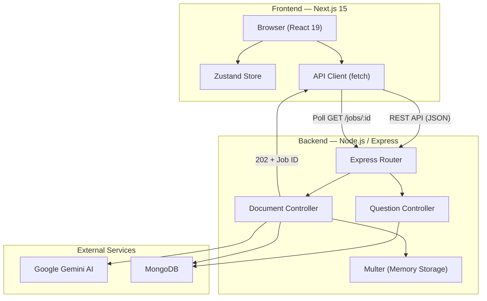
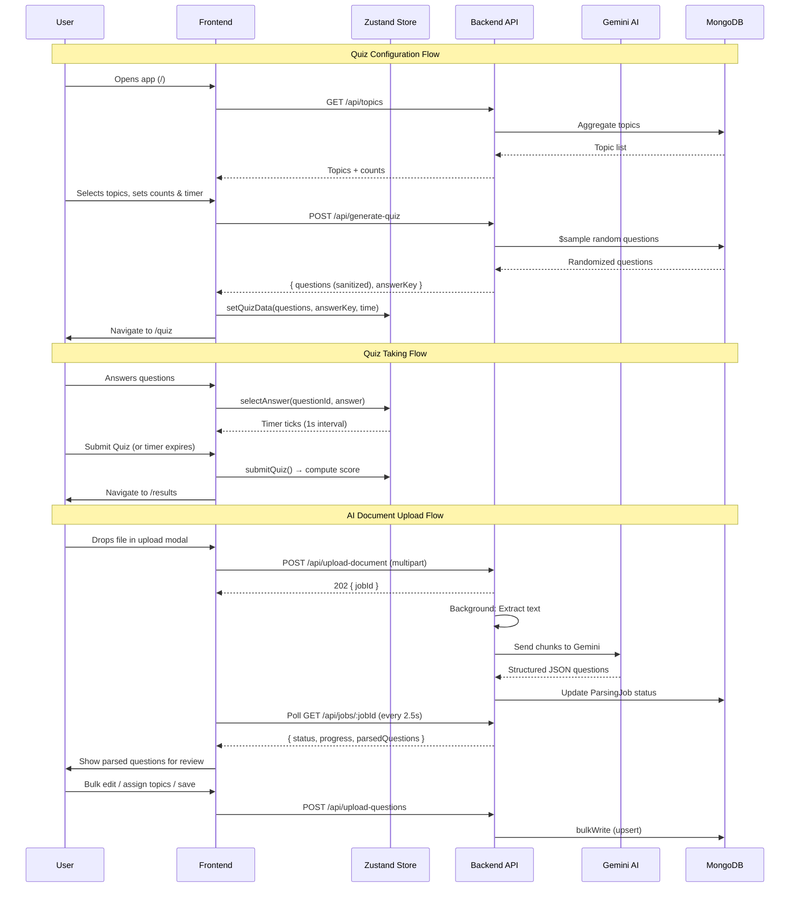
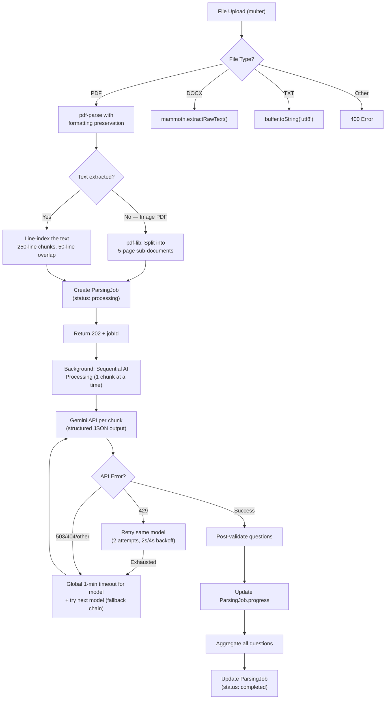
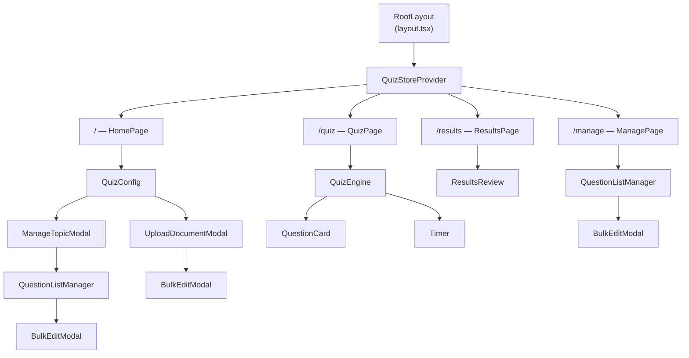
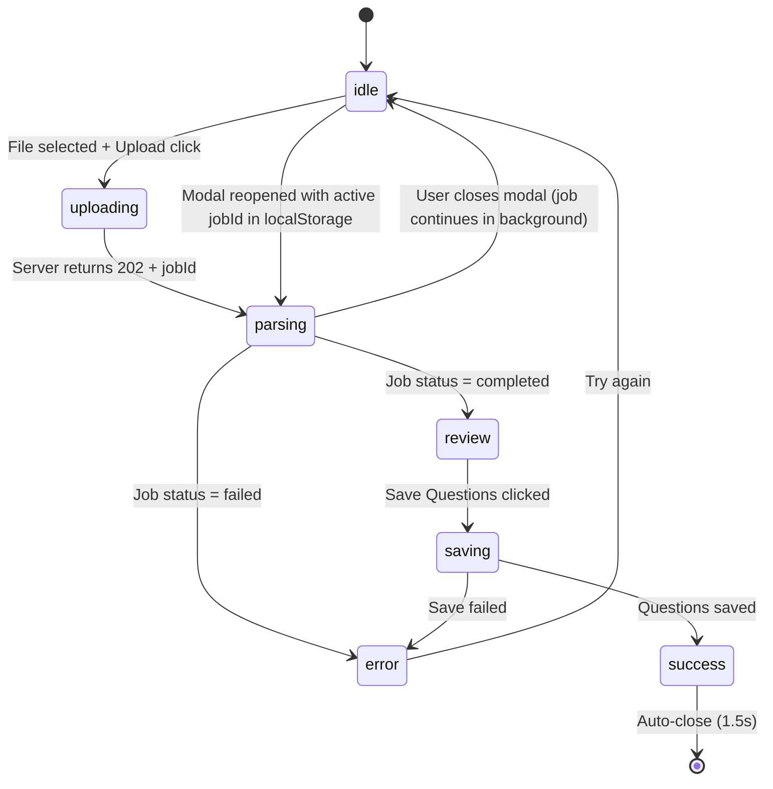

# QuizMaster — Technical Documentation

> **Version:** 1.1.0  
> **License:** MIT — Copyright © 2026 Shashwat Khare  
> **Last Updated:** July 2026

---

## Table of Contents

1. [System Overview](#1-system-overview)
2. [Architecture](#2-architecture)
3. [Technology Stack](#3-technology-stack)
4. [Project Structure](#4-project-structure)
5. [Backend](#5-backend)
   - [Entry Point & Server Startup](#51-entry-point--server-startup)
   - [Express Application Factory](#52-express-application-factory)
   - [Database Configuration](#53-database-configuration)
   - [Data Models](#54-data-models)
   - [API Reference](#55-api-reference)
   - [Document Processing Pipeline](#56-document-processing-pipeline)
   - [Error Handling](#57-error-handling)
6. [Frontend](#6-frontend)
   - [Routing & Page Guards](#61-routing--page-guards)
   - [Component Architecture](#62-component-architecture)
   - [State Management (Zustand)](#63-state-management-zustand)
   - [TypeScript Type System](#64-typescript-type-system)
   - [API Client](#65-api-client)
   - [Design System](#66-design-system)
7. [Environment Configuration](#7-environment-configuration)
8. [Testing](#8-testing)
9. [Build & Deployment](#9-build--deployment)
10. [Appendices](#10-appendices)

---

## 1. System Overview

QuizMaster is a full-stack quiz application that combines manual question management with AI-powered document parsing. Users can upload PDF, DOCX, or TXT files and let Google's Gemini AI automatically extract structured quiz questions — complete with topics, subtopics, sources, options, answers, and explanations. The application also supports manual question CRUD, multi-select bulk editing, dynamic quiz generation with configurable parameters, timed quiz-taking, and detailed results review.

### Key Capabilities

| Capability | Description |
|---|---|
| **AI Document Parsing** | Upload documents → Gemini AI extracts structured questions with topics, subtopics, sources, and explanations |
| **Background Job Processing** | Document parsing runs as an async background job with status polling — survives modal close and page refresh |
| **Smart Formatting** | Preserves markdown bold/italic formatting from source PDFs |
| **Multi-Select Bulk Edit** | Select multiple questions and update any field (topic, subtopic, source, context, explanation, etc.) in one operation |
| **Question Management** | Full CRUD operations: create, search, inline-edit, bulk-edit, bulk-delete, grouped views |
| **Dynamic Quiz Generation** | Select topics, set question counts per topic, configure time limits |
| **Timed Quiz Engine** | Sequential question navigation, countdown timer, auto-submit on timeout |
| **Results Analytics** | Score percentage, circular progress ring, per-question detailed review |

---

## 2. Architecture

### High-Level Architecture


```mermaid
graph TB
    subgraph Client["Frontend — Next.js 15"]
        Browser["Browser (React 19)"]
        Store["Zustand Store"]
        API_Client["API Client (fetch)"]
    end

    subgraph Server["Backend — Node.js / Express"]
        Routes["Express Router"]
        QCtrl["Question Controller"]
        DCtrl["Document Controller"]
        Multer["Multer (Memory Storage)"]
    end

    subgraph External["External Services"]
        Gemini["Google Gemini AI"]
        MongoDB["MongoDB"]
    end

    Browser --> Store
    Browser --> API_Client
    API_Client -->|"REST API (JSON)"| Routes
    Routes --> QCtrl
    Routes --> DCtrl
    DCtrl --> Multer
    DCtrl -->|"202 + Job ID"| API_Client
    API_Client -->|"Poll GET /jobs/:id"| Routes
    QCtrl --> MongoDB
    DCtrl --> Gemini
    DCtrl --> MongoDB
```

### Data Flow


```mermaid
sequenceDiagram
    participant U as User
    participant F as Frontend
    participant S as Zustand Store
    participant B as Backend API
    participant AI as Gemini AI
    participant DB as MongoDB

    Note over U,DB: Quiz Configuration Flow
    U->>F: Opens app (/)
    F->>B: GET /api/topics
    B->>DB: Aggregate topics
    DB-->>B: Topic list
    B-->>F: Topics + counts
    U->>F: Selects topics, sets counts & timer
    F->>B: POST /api/generate-quiz
    B->>DB: $sample random questions
    DB-->>B: Randomized questions
    B-->>F: { questions (sanitized), answerKey }
    F->>S: setQuizData(questions, answerKey, time)
    F->>U: Navigate to /quiz

    Note over U,DB: Quiz Taking Flow
    U->>F: Answers questions
    F->>S: selectAnswer(questionId, answer)
    S-->>F: Timer ticks (1s interval)
    U->>F: Submit Quiz (or timer expires)
    F->>S: submitQuiz() → compute score
    F->>U: Navigate to /results

    Note over U,DB: AI Document Upload Flow
    U->>F: Drops file in upload modal
    F->>B: POST /api/upload-document (multipart)
    B-->>F: 202 { jobId }
    B->>B: Background: Extract text
    B->>AI: Send chunks to Gemini
    AI-->>B: Structured JSON questions
    B->>DB: Update ParsingJob status
    F->>B: Poll GET /api/jobs/:jobId (every 2.5s)
    B-->>F: { status, progress, parsedQuestions }
    F->>U: Show parsed questions for review
    U->>F: Bulk edit / assign topics / save
    F->>B: POST /api/upload-questions
    B->>DB: bulkWrite (upsert)
```

### Design Principles

1. **Separation of Concerns** — Entry point → App factory → Routes → Controllers → Models
2. **Answer Security** — Quiz generation strips answers from questions; answers sent in a separate `answerKey` object
3. **Deduplication** — Compound unique index on `{ topic, subtopic, question_text }` prevents duplicate questions
4. **Async Job Processing** — Long-running AI operations run as background jobs with status polling for reliable progress tracking
5. **AI Model Resilience** — Dynamic model discovery with scoring, sorting, and automatic fallback on rate limits
6. **SSR-Safe State** — Zustand vanilla store + React context provider pattern for Next.js App Router compatibility

---

## 3. Technology Stack

### Frontend

| Technology | Version | Purpose |
|---|---|---|
| Next.js | 15.1.0 | React meta-framework with App Router |
| React | 19.0.0 | UI component library |
| TypeScript | ^5 | Static type checking |
| Tailwind CSS | ^4.0.0 | Utility-first CSS framework |
| Zustand | ^5.0.0 | Lightweight state management |
| Lucide React | ^1.22.0 | Icon library |
| React Markdown | ^10.1.0 | Markdown rendering |
| Playwright | ^1.61.1 | E2E browser testing |
| Jest | ^29.7.0 | Unit testing |
| Testing Library | ^16.0.0 | Component testing utilities |

### Backend

| Technology | Version | Purpose |
|---|---|---|
| Node.js | — | JavaScript runtime |
| Express | ^4.21.0 | HTTP server framework |
| Mongoose | ^8.7.0 | MongoDB ODM |
| @google/genai | ^2.10.0 | Google Gemini AI SDK |
| multer | ^2.2.0 | Multipart form data handling |
| pdf-parse | ^1.1.1 | PDF text extraction |
| pdf-lib | ^1.17.1 | PDF document manipulation (splitting image PDFs) |
| mammoth | ^1.12.0 | DOCX to HTML conversion |
| dotenv | ^16.4.5 | Environment variable loading |
| cors | ^2.8.5 | Cross-Origin Resource Sharing |
| Jest | ^29.7.0 | Backend testing |
| Supertest | ^7.0.0 | HTTP assertion library |
| mongodb-memory-server | ^10.0.0 | In-memory MongoDB for testing |

---

## 4. Project Structure

```
quiz-app/
├── backend/
│   ├── src/
│   │   ├── app.js                    # Express app factory
│   │   ├── config/
│   │   │   └── db.js                 # MongoDB connection helper
│   │   ├── controllers/
│   │   │   ├── questionController.js # Question CRUD + quiz generation
│   │   │   └── documentController.js # AI document parsing pipeline
│   │   ├── models/
│   │   │   ├── Question.js           # Question schema & model
│   │   │   ├── Config.js             # Key-value config model
│   │   │   └── ParsingJob.js         # Background parsing job model
│   │   ├── routes/
│   │   │   └── questionRoutes.js     # Route definitions + multer
│   │   └── services/
│   │       └── documentParsing.js    # Pure parsing helpers (ranking, chunking, reassembly)
│   ├── tests/
│   │   ├── api.test.js               # Core API route tests
│   │   ├── upload-document.test.js   # AI upload endpoint tests
│   │   ├── jobs.test.js              # Parsing-jobs API tests
│   │   ├── document-parsing.test.js  # Pure unit tests (no database)
│   │   ├── route-ordering.test.js    # Order-dependent route guards
│   │   └── helpers/
│   │       ├── db.js                 # In-memory MongoDB setup/teardown
│   │       ├── setup.js              # Test environment setup
│   │       ├── jobs.js               # waitForJob / deferred
│   │       └── genai-mock.js         # Shared @google/genai mock
│   ├── server.js                     # Entry point
│   ├── seed_config.js                # API key seeding script
│   ├── cleanup-e2e.js                # E2E test data cleanup
│   ├── jest.config.js                # Jest configuration
│   ├── package.json
│   ├── .env.example
│   └── .env
│
├── frontend/
│   ├── src/
│   │   ├── app/
│   │   │   ├── layout.tsx            # Root layout (fonts, providers)
│   │   │   ├── globals.css           # Theme tokens + utility classes
│   │   │   ├── page.tsx              # Home page → QuizConfig
│   │   │   ├── quiz/page.tsx         # Quiz page (guarded)
│   │   │   ├── results/page.tsx      # Results page (guarded)
│   │   │   └── manage/page.tsx       # Global question manager
│   │   ├── components/
│   │   │   ├── QuizConfig.tsx        # Topic selection & quiz setup
│   │   │   ├── QuizEngine.tsx        # Quiz-taking engine
│   │   │   ├── QuestionCard.tsx      # Single question display
│   │   │   ├── Timer.tsx             # Countdown timer
│   │   │   ├── ResultsReview.tsx     # Post-quiz results & review
│   │   │   ├── QuestionListManager.tsx  # Reusable question CRUD list
│   │   │   ├── BulkEditModal.tsx     # Multi-select bulk edit modal
│   │   │   ├── UploadDocumentModal.tsx  # AI document upload modal
│   │   │   └── ManageTopicModal.tsx  # Per-topic management modal
│   │   ├── stores/
│   │   │   ├── quiz-store.ts         # Zustand store definition
│   │   │   └── quiz-store-provider.tsx # React context provider
│   │   ├── types/
│   │   │   └── index.ts             # TypeScript type definitions
│   │   └── lib/
│   │       ├── api.ts               # API client functions
│   │       └── formatText.tsx       # Markdown text formatter
│   ├── __tests__/
│   │   └── QuizEngine.test.tsx      # Component unit tests
│   ├── jest.config.ts
│   ├── jest.setup.ts
│   ├── next.config.ts               # /api rewrite proxy → BACKEND_ORIGIN
│   ├── tsconfig.json
│   ├── postcss.config.mjs
│   ├── package.json
│   ├── .env.example
│   └── .env.local
│
├── e2e-test/
│   ├── tests/
│   │   ├── quiz-flow.spec.ts        # Playwright E2E test suite
│   │   └── test-files/              # Test fixture files
│   ├── scripts/
│   │   └── cleanup-e2e.js           # E2E test data cleanup
│   ├── playwright.config.ts         # Playwright configuration
│   ├── record.js                    # Puppeteer visual E2E recorder
│   ├── test-comprehension.js        # Comprehension flow test
│   ├── test-volume.js               # Volume testing
│   ├── test-files/                  # Test fixture files
│   └── package.json
│
├── docs/
│   ├── TECHNICAL_DOCUMENTATION.md   # This file
│   └── USER_MANUAL.md               # End-user guide
│
├── .gitignore
├── README.md
├── AI_UPLOAD_FEATURE.md
├── TESTING_GUIDE.md
└── LICENSE
```

---

## 5. Backend

### 5.1. Entry Point & Server Startup

[server.js](file:///e:/Projects/quiz-app/backend/server.js) is the application entry point:

1. Loads environment variables via `dotenv`
2. Imports the Express app and the database connector
3. Awaits MongoDB connection via `connectDB()`
4. Starts the HTTP server on the configured `PORT` (default: `5000`)
5. Logs a startup message with health-check URL

```javascript
// Simplified startup flow
require('dotenv').config();
const app = require('./src/app');
const connectDB = require('./src/config/db');

(async () => {
  await connectDB();
  app.listen(PORT, () => console.log(`Server running on port ${PORT}`));
})();
```

### 5.2. Express Application Factory

[app.js](file:///e:/Projects/quiz-app/backend/src/app.js) configures the Express application:

**Middleware Stack (in order):**

| Order | Middleware | Configuration |
|---|---|---|
| 1 | `cors()` | Origin: `CORS_ORIGIN` env var (default `'*'`), Methods: `GET, POST, PUT, DELETE` |
| 2 | `express.json()` | Body size limit: `10mb` |
| 3 | Routes | All `/api/*` routes → `questionRoutes` |
| 4 | Health check | `GET /health` → `{ status: 'ok', timestamp }` |
| 5 | Global error handler | 4-argument middleware, returns `500` with error details in development |

### 5.3. Database Configuration

[db.js](file:///e:/Projects/quiz-app/backend/src/config/db.js) provides the `connectDB()` function:

- Connects to MongoDB using the `MONGODB_URI` environment variable
- Logs the connected host on success
- **Hard exits** (`process.exit(1)`) on connection failure — this is intentional for deployment environments where a missing database should prevent startup

### 5.4. Data Models

#### Question Model

[Question.js](file:///e:/Projects/quiz-app/backend/src/models/Question.js) — The core data model for quiz questions.

**Schema:**

| Field | Type | Required | Validation | Indexing |
|---|---|---|---|---|
| `topic` | `String` | ✅ | `trim: true` | Single-field index |
| `subtopic` | `String` | ❌ | `trim: true` | Single-field index |
| `source` | `String` | ❌ | `trim: true` | Single-field index |
| `context` | `String` | ❌ | `trim: true` | — |
| `question_text` | `String` | ✅ | `trim: true` | Part of compound unique index |
| `options` | `[String]` | ✅ | Min 2 items | — |
| `correct_answer` | `String` | ✅ | `trim: true` | — |
| `explanation` | `String` | ✅ | `trim: true` | — |
| `createdAt` | `Date` | Auto | `timestamps: true` | — |
| `updatedAt` | `Date` | Auto | `timestamps: true` | — |

**Compound Unique Index:** `{ topic: 1, subtopic: 1, question_text: 1 }` — prevents duplicate questions within the same topic and subtopic.

> [!NOTE]
> The `subtopic` field defaults to `'General'` during upsert operations if not provided, ensuring the compound index always has a value for deduplication.

#### ParsingJob Model

[ParsingJob.js](file:///e:/Projects/quiz-app/backend/src/models/ParsingJob.js) — Tracks the status of background document parsing jobs.

**Schema:**

| Field | Type | Default | Notes |
|---|---|---|---|
| `status` | `String` | `'pending'` | Enum: `pending`, `processing`, `completed`, `failed`, `cancelled` |
| `fileName` | `String` | `'Unknown Document'` | Original uploaded file name, shown in background job lists |
| `progress` | `Number` | `0` | Count of questions parsed so far |
| `totalChunks` | `Number` | `0` | Total number of document chunks to process |
| `chunksMeta` | `Array` | `[]` | Per-chunk live tracking subdocuments (see below) |
| `parsedQuestions` | `Array` | `[]` | Parsed question objects (populated on completion) |
| `error` | `String` | `null` | Error message (populated on failure or cancellation) |
| `createdAt` | `Date` | Auto | `timestamps: true` |
| `updatedAt` | `Date` | Auto | `timestamps: true` |

**`chunksMeta[]` subdocument** — one entry per document chunk, updated live as the AI works so the frontend can render per-chunk progress:

| Field | Type | Default | Notes |
|---|---|---|---|
| `chunkIndex` | `Number` | — | Position of the chunk in the document |
| `pageRange` | `String` | — | Human-readable page range this chunk covers, e.g. `"3-5"` |
| `status` | `String` | `'pending'` | Enum: `pending`, `processing`, `completed`, `failed`, `rate_limited` |
| `currentModel` | `String` | `null` | Gemini model currently/last used for this chunk |
| `attempt` | `Number` | `0` | Current attempt number against `currentModel` |
| `message` | `String` | `'Waiting to start'` | Human-readable status line shown in the UI |
| `attemptsHistory` | `Array` | `[]` | Log of every attempt: `{ model, attemptNumber, status, message, timestamp }` |

**Lifecycle:** Created when a document is uploaded, with `chunksMeta` pre-populated (`status: 'pending'`) for every chunk. Updated live during processing — both the top-level `progress` count and each chunk's `chunksMeta` entry. Finalized with `status: 'completed'` + `parsedQuestions`, `status: 'failed'` + `error`, or `status: 'cancelled'` (set by `POST /api/jobs/:jobId/cancel`) + `error: 'Cancelled by user'`.

**Terminal states are final.** `completed`, `failed` and `cancelled` are all written conditionally on the job still being `processing`, so the background worker can never overwrite a status set out from under it.

#### Config Model

[Config.js](file:///e:/Projects/quiz-app/backend/src/models/Config.js) — Key-value store for application configuration.

| Field | Type | Required | Notes |
|---|---|---|---|
| `key` | `String` | ✅ | `unique: true`, `trim: true` |
| `value` | `Mixed` | ✅ | Can hold any type (string, object, etc.) |

Used primarily to store the `GEMINI_API_KEY` in the database as an alternative to environment variables.

---

### 5.5. API Reference

All routes are prefixed with `/api` and defined in [questionRoutes.js](file:///e:/Projects/quiz-app/backend/src/routes/questionRoutes.js).

---

#### `POST /api/upload-questions`

Bulk upsert questions into the database.

**Controller:** [questionController.uploadQuestions](file:///e:/Projects/quiz-app/backend/src/controllers/questionController.js)

**Request Body:**
```json
[
  {
    "topic": "Mathematics",
    "subtopic": "Algebra",
    "source": "Chapter 3 — Textbook",
    "context": "Optional passage or context for the question",
    "question_text": "What is 2 + 2?",
    "options": ["3", "4", "5", "6"],
    "correct_answer": "4",
    "explanation": "Basic addition: 2 + 2 = 4"
  }
]
```

**Validation Rules:**
- Body must be a non-empty array
- Each object requires: `topic`, `question_text`, `options`, `correct_answer`, `explanation`
- `options` must be an array with ≥ 2 items

**Deduplication:** Uses `bulkWrite` with `updateOne` + `upsert: true`. Filter key: `{ topic, subtopic (default 'General'), question_text }`.

**Response `201`:**
```json
{
  "message": "Questions uploaded successfully",
  "upsertedCount": 5,
  "modifiedCount": 2,
  "totalProcessed": 7
}
```

**Errors:** `400` for validation failures.

---

#### `POST /api/upload-document`

Upload a document file for AI-powered question extraction. Returns immediately with a job ID for background processing.

**Controller:** [documentController.uploadDocument](file:///e:/Projects/quiz-app/backend/src/controllers/documentController.js)

**Request:** `multipart/form-data` with a `file` field (via multer memory storage).

**Supported File Types:** `.pdf`, `.docx`, `.txt`

**Response `202` (Accepted):**
```json
{
  "message": "Document accepted for processing",
  "jobId": "668a1b2c3d4e5f6789012345"
}
```

The frontend then polls `GET /api/jobs/:jobId` to track progress and retrieve results.

**Errors:** `400` for unsupported file types or empty documents. `500` for missing API key.

> [!IMPORTANT]
> See [Section 5.6: Document Processing Pipeline](#56-document-processing-pipeline) for detailed technical breakdown.

---

#### `GET /api/jobs/:jobId`

Check the status of a background document parsing job.

**Controller:** [documentController.getJobStatus](file:///e:/Projects/quiz-app/backend/src/controllers/documentController.js)

**URL Parameter:** `jobId` — MongoDB ObjectId of the ParsingJob

**Response `200`:**
```json
{
  "_id": "668a1b2c3d4e5f6789012345",
  "status": "completed",
  "progress": 25,
  "totalChunks": 3,
  "parsedQuestions": [ ... ],
  "error": null,
  "createdAt": "2026-07-01T00:00:00.000Z",
  "updatedAt": "2026-07-01T00:01:00.000Z"
}
```

**Status values:**

| Status | Meaning |
|---|---|
| `pending` | Job created, not yet started |
| `processing` | AI is actively parsing document chunks |
| `completed` | All chunks processed; `parsedQuestions` populated |
| `failed` | Processing failed; `error` field contains details |
| `cancelled` | Job was cancelled by the user via `POST /api/jobs/:jobId/cancel` |

**Errors:** `404` if job not found.

---

#### `GET /api/jobs/active`

List all currently active (non-terminal) parsing jobs, most recent first. Used by the frontend to show a "Background Jobs" list across modal sessions/page reloads, independent of the `jobId` stored in `localStorage`.

**Controller:** [documentController.getActiveJobs](file:///e:/Projects/quiz-app/backend/src/controllers/documentController.js)

**Response `200`:** Array of `ParsingJob` documents with `status` in `['pending', 'processing']`, sorted by `createdAt` descending.

---

#### `POST /api/jobs/:jobId/cancel`

Cancel an in-progress or pending parsing job.

**Controller:** [documentController.cancelJob](file:///e:/Projects/quiz-app/backend/src/controllers/documentController.js)

**URL Parameter:** `jobId` — MongoDB ObjectId of the ParsingJob

**Behavior:** Conditionally sets `status: 'cancelled'` and `error: 'Cancelled by user'` — the update is applied via `findOneAndUpdate` matching `status ∈ {pending, processing}`, so a job that reaches a terminal state between the read and the write is never re-opened.

Before starting each chunk, the background loop re-reads the job's `status` from MongoDB and aborts if it is anything other than `processing` — so cancellation takes effect between chunks, not mid-request.

**Cancellation is not failure.** The abort raises a `JobCancelledError` sentinel, which the worker's outer `catch` recognises and returns from without writing any status. All three terminal writes (`completed`, `failed`, and the "no questions extracted" failure) additionally go through a guard matching `status: 'processing'`, so none of them can demote a job that is already `cancelled`. A cancelled job therefore stays `cancelled`, and cancelled jobs remain distinguishable from crashed ones in the data.

**Response `200`:**
```json
{ "message": "Job cancelled successfully", "job": { "...": "..." } }
```

**Errors:** `404` if job not found. `400` if the job is not `pending` or `processing` (already completed/failed/cancelled).

---

#### `GET /api/topics`

Retrieve all topics with question counts and subtopic breakdown.

**Controller:** [questionController.getTopics](file:///e:/Projects/quiz-app/backend/src/controllers/questionController.js)

**Response `200`:**
```json
[
  {
    "_id": "Mathematics",
    "count": 45,
    "subtopics": [
      { "name": "Algebra", "count": 20 },
      { "name": "Calculus", "count": 25 }
    ]
  }
]
```

**Implementation:** Two-stage MongoDB aggregation — first groups by `{ topic, subtopic }` with count, then re-groups by topic, summing counts and collecting subtopics. Sorted alphabetically by topic name.

---

#### `GET /api/sources`

Retrieve all distinct, non-empty source values.

**Controller:** [questionController.getSources](file:///e:/Projects/quiz-app/backend/src/controllers/questionController.js)

**Response `200`:**
```json
["Chapter 1 — Biology", "Lecture Notes", "Practice Exam 2"]
```

**Implementation:** Uses `Question.distinct('source')`, filters out null/undefined/empty strings, sorts alphabetically.

---

#### `POST /api/generate-quiz`

Generate a randomized quiz from selected topics.

**Controller:** [questionController.generateQuiz](file:///e:/Projects/quiz-app/backend/src/controllers/questionController.js)

**Request Body:**
```json
{
  "topics": [
    { "topic": "Mathematics", "count": 5 },
    { "topic": "Science", "count": 3 }
  ]
}
```

**Validation:** `topics` must be a non-empty array; each entry requires `topic` (string) and `count` (number ≥ 1).

**Response `200`:**
```json
{
  "questions": [
    {
      "_id": "665a...",
      "topic": "Mathematics",
      "subtopic": "Algebra",
      "source": "Chapter 3",
      "context": "Optional context passage",
      "question_text": "What is x if 2x = 10?",
      "options": ["3", "4", "5", "6"]
    }
  ],
  "answerKey": {
    "665a...": {
      "correct_answer": "5",
      "explanation": "Divide both sides by 2: x = 10/2 = 5"
    }
  },
  "totalQuestions": 8
}
```

> [!IMPORTANT]
> **Answer Separation:** The `correct_answer` and `explanation` fields are **stripped** from the `questions` array and placed in the separate `answerKey` object, keyed by question `_id`. This ensures the client cannot peek at answers during the quiz.

**Randomization:** Uses MongoDB `$sample` for per-topic random selection, then applies a **Fisher-Yates shuffle** across all selected questions.

---

#### `GET /api/topics/:topic/questions`

Retrieve all questions for a specific topic.

**Controller:** [questionController.getQuestionsByTopic](file:///e:/Projects/quiz-app/backend/src/controllers/questionController.js)

**URL Parameter:** `topic` — URL-encoded topic name

**Response `200`:** Array of full question documents (including `correct_answer` and `explanation`), sorted by `subtopic` ascending.

---

#### `GET /api/questions/search`

Search questions across all fields.

**Controller:** [questionController.searchQuestions](file:///e:/Projects/quiz-app/backend/src/controllers/questionController.js)

**Query Parameter:** `q` (string, optional)

**Behavior:**
- If `q` is empty/undefined: returns **all** questions, sorted by `{ topic: 1, subtopic: 1 }`
- Otherwise: case-insensitive regex search across `question_text`, `options`, `explanation`, `correct_answer`, `topic`, `subtopic`, `source`

**Response `200`:** Array of matching question documents.

---

#### `PUT /api/questions/:id`

Update a single question by ID.

**Controller:** [questionController.updateQuestion](file:///e:/Projects/quiz-app/backend/src/controllers/questionController.js)

**URL Parameter:** `id` — MongoDB ObjectId

**Request Body:** Partial question object (only fields to update).

```json
{
  "question_text": "Updated question text",
  "source": "New Source Tag",
  "options": ["Option A", "Option B", "Option C"]
}
```

**Response `200`:** Updated full question document.

**Errors:** `404` if question not found.

---

#### `PUT /api/questions/bulk`

Bulk update multiple questions with the same field values.

**Controller:** [questionController.bulkUpdateQuestions](file:///e:/Projects/quiz-app/backend/src/controllers/questionController.js)

**Request Body:**
```json
{
  "ids": ["665a...", "665b...", "665c..."],
  "updateData": {
    "topic": "New Topic Name",
    "source": "Shared Source"
  }
}
```

**Validation:**
- `ids` must be a non-empty array
- `updateData` must be a non-empty object

**Response `200`:**
```json
{
  "message": "X questions updated successfully",
  "modifiedCount": 3
}
```

> [!NOTE]
> The `/questions/bulk` route is registered BEFORE `/questions/:id` in the router to prevent Express from matching "bulk" as a question ID.

---

#### `DELETE /api/questions`

Bulk delete questions by IDs.

**Controller:** [questionController.deleteQuestions](file:///e:/Projects/quiz-app/backend/src/controllers/questionController.js)

**Request Body:**
```json
{
  "ids": ["665a...", "665b...", "665c..."]
}
```

**Validation:** `ids` must be a non-empty array.

**Response `200`:**
```json
{
  "message": "X questions deleted successfully",
  "deletedCount": 3
}
```

---

#### `GET /health`

Health check endpoint.

**Response `200`:**
```json
{
  "status": "ok",
  "timestamp": "2026-07-01T00:00:00.000Z"
}
```

---

### 5.6. Document Processing Pipeline

The document upload pipeline in [documentController.js](file:///e:/Projects/quiz-app/backend/src/controllers/documentController.js) is the most complex backend component. It uses an **async background job pattern** — the upload endpoint returns immediately with a job ID, and processing happens asynchronously.


```mermaid
flowchart TD
    A["File Upload (multer)"] --> B{File Type?}
    B -->|PDF| C["pdf-parse with<br/>formatting preservation"]
    B -->|DOCX| D["mammoth.extractRawText()"]
    B -->|TXT| E["buffer.toString('utf8')"]
    B -->|Other| F["400 Error"]

    C --> G{Text extracted?}
    G -->|No — Image PDF| H["pdf-lib: Split into<br/>5-page sub-documents"]
    G -->|Yes| I["Line-index the text<br/>250-line chunks, 50-line overlap"]
    
    H --> J0["Create ParsingJob<br/>(status: processing)"]
    I --> J0
    J0 --> J0b["Return 202 + jobId"]
    J0b --> J["Background: Sequential AI<br/>Processing (1 chunk at a time)"]

    J --> K["Gemini API per chunk<br/>(structured JSON output)"]
    K --> L{API Error?}
    L -->|429| R["Retry same model<br/>(2 attempts, 2s/4s backoff)"]
    R -->|Exhausted| M["Global 1-min timeout for model<br/>+ try next model (fallback chain)"]
    L -->|503/404/other| M
    L -->|Success| N["Post-validate questions"]
    M --> K

    N --> O["Update ParsingJob.progress"]
    O --> P["Aggregate all questions"]
    P --> Q["Update ParsingJob<br/>(status: completed)"]
```

#### Step 1: API Key Resolution
The controller first checks the MongoDB `Config` collection for a stored `GEMINI_API_KEY`. If not found, it falls back to `process.env.GEMINI_API_KEY`. Returns `500` if neither source provides a key.

#### Step 2: Text Extraction

| Format | Library | Details |
|---|---|---|
| **PDF** | `pdf-parse` | Custom `render_page` function preserves **bold** (`**`) and *italic* (`*`) markdown formatting by inspecting font names. Detects image-only PDFs (zero text extracted). |
| **DOCX** | `mammoth` | Extracts raw text via `extractRawText()`. |
| **TXT** | Native | Direct `buffer.toString('utf8')`. |

#### Step 3: Document Chunking

- **Image PDFs:** Uses `pdf-lib` to split into sub-documents of **max 5 pages each**. Each sub-document is sent as base64-encoded binary (`inlineData`) to Gemini.
- **Text documents:** Every non-blank line is assigned an index and recorded in a server-side dictionary along with the page it came from (derived from the `___PAGE_START_n___` markers, which are consumed here rather than indexed). The line-numbered text is then split into windows of **max 250 lines with a 50-line overlap** — the overlap ensures a question straddling a boundary is seen whole by at least one chunk, and the resulting duplicates are removed later by `question_text` dedup.

The chunker, the line dictionary and the page-range derivation live in [services/documentParsing.js](file:///e:/Projects/quiz-app/backend/src/services/documentParsing.js) as pure functions, and are unit-tested directly.

#### Step 4: Job Creation & Immediate Response

A `ParsingJob` document is created in MongoDB with `status: 'processing'`, `fileName` (original upload name), `totalChunks`, and a pre-populated `chunksMeta` array (one entry per chunk, `status: 'pending'`). The endpoint immediately returns `202 Accepted` with the `jobId`. All subsequent processing happens in a fire-and-forget async IIFE.

#### Step 5: AI Model Selection

The `getAvailableModels()` function dynamically discovers available Gemini models and scores them:

| Model Pattern | Score Modifier |
|---|---|
| `2.5-flash` | +100 (most preferred) |
| `2.0-flash` | +80 |
| `1.5-flash` | +50 |
| `pro` variants | +20 |
| Non-free tier (`3.1`, `3.0`, `3-pro`) | -100 (excluded) |
| `lite` / `8b` | -10 (deprioritized) |
| Stable (no `preview`/`exp`) | +10 bonus |

Non-text models (`embedding`, `imagen`, `veo`, `tts`, `audio`, `aqa`, `research`, `antigravity`, `robotics`, `computer-use`) are dropped before scoring, as is anything that is not a `gemini` or `gemma` model. Anything scoring at or below **-50** is discarded; the survivors are ordered best-first, and that order doubles as the fallback chain.

Results are cached for **1 hour**. On API failure, falls back to hardcoded list: `gemini-2.5-pro`, `gemini-1.5-pro`, `gemini-2.5-flash`, `gemini-2.0-flash`, `gemini-1.5-flash`.

The scoring and filtering are pure functions (`getScore`, `isSupportedModel`, `rankModels`) in [services/documentParsing.js](file:///e:/Projects/quiz-app/backend/src/services/documentParsing.js); `getAvailableModels()` in the controller only handles the API call and the cache.

#### Step 6: Sequential Chunk Processing

Uses a custom `asyncBatch(items, limit=1, callback)` helper — chunks are processed **one at a time** (not concurrently). Before each chunk starts, the job's `status` is re-read from MongoDB; if it is no longer `processing` (e.g. cancelled via `POST /api/jobs/:jobId/cancel`), a `JobCancelledError` is thrown and processing stops immediately without altering the recorded status.

#### Step 7: Gemini API Call, Retries & Fallback

Each chunk is sent with:
- **Structured output** (`responseMimeType: 'application/json'`) with a response schema requiring: `topic`, `subtopic`, `question_text`, `options`, `correct_answer`, `explanation`, and optional `context`.
- **Model fallback loop:** For each scored model in turn (skipping any model currently in a global rate-limit timeout — see below):
  - On `429` (rate limit), retries the **same model** up to **2 times** with exponential backoff (`2s`, then `4s`) before giving up on it.
  - On persistent `429`/`503`/`404`/quota errors after retries are exhausted, that model is placed in a **1-minute global timeout** (tracked in an in-memory `Map`, shared across all chunks/jobs in the process) and the next model in the list is tried for the same chunk.
  - On any other error (e.g. bad JSON), the retry loop is abandoned and the next model is tried directly — no repeated retries against a model that's returning malformed output.
- **Live progress:** Before/after each attempt, the chunk's `chunksMeta` entry is updated in MongoDB (`status`, `currentModel`, `attempt`, `message`) and an entry is appended to `attemptsHistory`, so the frontend can render a live, per-chunk view of exactly which model is being tried and why it failed or succeeded.
- A **2-second delay** is inserted after a chunk succeeds, before moving to the next chunk, to stay under rate limits.

#### Step 8: Post-Validation

Each extracted question is validated:
- All required fields must be present and non-empty
- `options` must be an array with ≥ 2 items
- `correct_answer` must match one of the provided `options`

#### Step 9: Job Status Updates

After each chunk completes, the `ParsingJob.progress` field is updated with the running count of parsed questions, and the chunk's `chunksMeta` entry is marked `completed` or `failed`. On completion, the job transitions to `status: 'completed'` with `parsedQuestions` populated. On failure, `status: 'failed'` with an `error` message. On user cancellation, `status: 'cancelled'`.

Every terminal write goes through a `findOneAndUpdate({ _id, status: 'processing' }, …)` guard, so a job that was cancelled while the last chunk was in flight keeps its `cancelled` status instead of being overwritten.

The frontend polls `GET /api/jobs/:jobId` every 2.5 seconds to check progress and retrieve results, and separately polls `GET /api/jobs/active` to show all in-flight background jobs (with cancel controls) regardless of which job the current modal session is tracking. The poller treats `cancelled` as a terminal state: it stops polling, clears the stored `activeUploadJobId`, and returns to the upload screen without showing an error.

### 5.7. Error Handling

**Pattern:** All controller functions use `try/catch` with `next(error)` to delegate errors to the centralized Express error handler in [app.js](file:///e:/Projects/quiz-app/backend/src/app.js).

**Global Error Handler:**
- Logs `err.message` to console
- Returns `500 { error: 'Internal server error' }`
- In `development` mode (`NODE_ENV=development`), also includes `message: err.message` in the response

**Background Job Error Handling:** Errors during background processing update the `ParsingJob` document with `status: 'failed'` and the error message, allowing the frontend to display the error to the user on the next poll.

**Validation Errors:** Return `400` with descriptive error messages.

---

## 6. Frontend

### 6.1. Routing & Page Guards

The frontend uses the **Next.js App Router** with the following routes:

| Route | Page File | Component | Guard |
|---|---|---|---|
| `/` | [page.tsx](file:///e:/Projects/quiz-app/frontend/src/app/page.tsx) | `QuizConfig` | None (public) |
| `/quiz` | [quiz/page.tsx](file:///e:/Projects/quiz-app/frontend/src/app/quiz/page.tsx) | `QuizEngine` | Redirects to `/` if `totalQuestions === 0` |
| `/results` | [results/page.tsx](file:///e:/Projects/quiz-app/frontend/src/app/results/page.tsx) | `ResultsReview` | Redirects to `/` if `isSubmitted === false` |
| `/manage` | [manage/page.tsx](file:///e:/Projects/quiz-app/frontend/src/app/manage/page.tsx) | Global Manager | None (public) |

**Guard Mechanism:** Quiz and Results pages use `useEffect` hooks to check Zustand store state. If the guard condition fails, `router.replace('/')` redirects the user. During the redirect check, the pages return `null` to prevent flash of content.

### 6.2. Component Architecture


```mermaid
graph TD
    Layout["RootLayout<br/>(layout.tsx)"]
    Layout --> Provider["QuizStoreProvider"]
    Provider --> Home["/ — HomePage"]
    Provider --> Quiz["/quiz — QuizPage"]
    Provider --> Results["/results — ResultsPage"]
    Provider --> Manage["/manage — ManagePage"]

    Home --> QC["QuizConfig"]
    QC --> UDM["UploadDocumentModal"]
    QC --> MTM["ManageTopicModal"]
    MTM --> QLM1["QuestionListManager"]
    QLM1 --> BEM1["BulkEditModal"]

    Quiz --> QE["QuizEngine"]
    QE --> QCard["QuestionCard"]
    QE --> Timer["Timer"]

    Results --> RR["ResultsReview"]

    Manage --> QLM2["QuestionListManager"]
    QLM2 --> BEM2["BulkEditModal"]

    UDM --> BEM3["BulkEditModal"]
```

#### QuizConfig

[QuizConfig.tsx](file:///e:/Projects/quiz-app/frontend/src/components/QuizConfig.tsx) — The main landing page component.

**Responsibilities:**
- Fetch and display available topics from the API
- Toggle topic selection with keyboard accessibility (Enter/Space)
- Configure question count per topic (1 to max available)
- Set time limit (1-60 minutes, default 10)
- Generate quiz via API and set up Zustand store
- Navigate to `/quiz` on successful generation
- Open `UploadDocumentModal` and `ManageTopicModal`

**State:**

| State | Type | Default | Purpose |
|---|---|---|---|
| `topics` | `TopicSelection[]` | `[]` | Available topics with selection state |
| `timeLimit` | `number` | `10` | Time limit in minutes |
| `loading` | `boolean` | `true` | Topics loading indicator |
| `generating` | `boolean` | `false` | Quiz generation in progress |
| `error` | `string \| null` | `null` | Error message |
| `isUploadModalOpen` | `boolean` | `false` | Upload modal visibility |
| `manageTopicOpen` | `string \| null` | `null` | Topic name for manage modal |

#### QuizEngine

[QuizEngine.tsx](file:///e:/Projects/quiz-app/frontend/src/components/QuizEngine.tsx) — The core quiz-taking component.

**Responsibilities:**
- Display current question via `QuestionCard`
- Show progress bar and question counter
- Render `Timer` component
- Navigate between questions (Previous/Next)
- Handle submission with confirmation modal for incomplete quizzes
- Auto-navigate to `/results` on submission

#### QuestionCard

[QuestionCard.tsx](file:///e:/Projects/quiz-app/frontend/src/components/QuestionCard.tsx) — Single question renderer.

**Features:**
- Topic badge display
- Optional context passage (whitespace-preserved)
- Question text with markdown formatting
- Lettered option buttons (A, B, C, D...)
- Visual highlight for selected answer
- Re-animation on question change via `key` prop

#### Timer

[Timer.tsx](file:///e:/Projects/quiz-app/frontend/src/components/Timer.tsx) — Countdown timer with auto-submit.

**Visual States:**

| Condition | Style |
|---|---|
| > 60 seconds | White text |
| ≤ 60 seconds | Warning (amber) text |
| ≤ 30 seconds | Danger (red) text + pulse animation |

**Behavior:** 1-second interval calling `tickTimer()`. Auto-calls `submitQuiz()` when `timeRemaining` reaches 0.

#### ResultsReview

[ResultsReview.tsx](file:///e:/Projects/quiz-app/frontend/src/components/ResultsReview.tsx) — Post-quiz results display.

**Features:**
- Score summary with SVG circular progress ring
- Color-coded score display (green ≥80%, amber ≥50%, red <50%)
- Detailed per-question review:
  - Left colored border (green = correct, red = incorrect)
  - Question number and topic badges
  - Context passage and question text (markdown-formatted)
  - Options with color coding (green = correct, red = user's wrong choice)
  - "You did not answer" warning for unanswered questions
  - Explanation card with accent styling
- "Take New Quiz" button (resets store, navigates to `/`)

#### BulkEditModal

[BulkEditModal.tsx](file:///e:/Projects/quiz-app/frontend/src/components/BulkEditModal.tsx) — Portal-rendered modal for bulk field editing.

**Exported Type:** `EditableField = 'topic' | 'subtopic' | 'source' | 'context' | 'explanation' | 'question_text' | 'correct_answer'`

**Props:**

| Prop | Type | Description |
|---|---|---|
| `isOpen` | `boolean` | Controls visibility |
| `onClose` | `() => void` | Close callback |
| `onApply` | `(field: EditableField, value: string) => void` | Applies the edit to all selected questions |
| `selectedCount` | `number` | Number of selected questions (displayed in UI) |
| `existingTopics` | `string[]` | Autocomplete suggestions for topic field |
| `existingSources` | `string[]` | Autocomplete suggestions for source field |

**Features:**
- Renders via `createPortal` to `document.body` at `z-[60]` (above other modals)
- Field selector dropdown with 7 editable fields
- Conditional input: `<input>` with `<datalist>` for short fields (topic, subtopic, source, correct_answer), `<textarea>` for long fields (context, explanation, question_text)
- Autocomplete from existing topics/sources via datalist
- Cancel and "Apply to All" buttons

**Used by:** `QuestionListManager` (for managing existing DB questions) and `UploadDocumentModal` (for reviewing parsed questions before save).

#### QuestionListManager

[QuestionListManager.tsx](file:///e:/Projects/quiz-app/frontend/src/components/QuestionListManager.tsx) — Reusable CRUD component for question management.

**Props:**

| Prop | Type | Description |
|---|---|---|
| `questions` | `QuestionData[]` | Questions to display |
| `onDelete` | `(ids: string[]) => Promise<void>` | Delete callback |
| `onUpdate` | `(id: string, data: Partial<QuestionData>) => Promise<void>` | Single-question update callback |
| `onBulkUpdate` | `(ids: string[], data: Partial<QuestionData>) => Promise<void>` | **Optional.** Bulk update callback — when provided, enables the Bulk Edit button |
| `groupByTopic` | `boolean` | Whether to group by topic/subtopic headers |
| `isLoading` | `boolean` | Loading state |

**Features:**
- Text search filtering across all question fields (including `source`)
- Select all / individual checkbox selection
- **Bulk Edit** with `BulkEditModal` (visible when `onBulkUpdate` is provided and items are selected)
- Bulk delete with confirmation dialog
- Inline edit mode (topic, subtopic, source with datalist, context, question, options, correct answer, explanation)
- Expand/collapse detail views with source badges
- Grouped display by topic → subtopic (with sticky headers)
- "Uncategorized in Database" badge for questions without subtopics
- Fetches existing sources from `GET /api/sources` on mount for datalist autocomplete

#### UploadDocumentModal

[UploadDocumentModal.tsx](file:///e:/Projects/quiz-app/frontend/src/components/UploadDocumentModal.tsx) — Full-featured AI document upload modal (740 lines).

**Props:**

| Prop | Type | Description |
|---|---|---|
| `isOpen` | `boolean` | Modal visibility |
| `onClose` | `() => void` | Close callback |
| `onSuccess` | `() => void` | Success callback (triggers topic reload) |

**Status Flow:**


```mermaid
stateDiagram-v2
    [*] --> idle
    idle --> uploading: File selected + Upload click
    uploading --> parsing: Server returns 202 + jobId
    parsing --> review: Job status = completed
    parsing --> error: Job status = failed
    parsing --> idle: User closes modal (job continues in background)
    idle --> parsing: Modal reopened with active jobId in localStorage
    review --> saving: Save Questions clicked
    saving --> success: Questions saved
    saving --> error: Save failed
    success --> [*]: Auto-close (1.5s)
    error --> idle: Try again
```

**Features:**
- Drag-and-drop file zone with visual feedback
- **Background job processing** — upload returns `202` with `jobId`, frontend polls every 2.5s
- **Job persistence** — `jobId` stored in `localStorage`, survives modal close and page refresh
- **"Hide Progress" button** — allows closing modal while parsing continues
- **Background Jobs panel** — polls `GET /api/jobs/active` independently of the tracked `jobId`, listing every in-progress job (shown on the idle screen and during active parsing). Each job card is expandable to a **live per-chunk view**: status icon, page range, current model, attempt count, and a further-expandable **attempt history** (model, attempt number, status, message, timestamp) sourced from `ParsingJob.chunksMeta`. Each job has a **Stop** button that calls `POST /api/jobs/:jobId/cancel`.
- **Job Summary** — on the Review screen, the tracked job's own live card (via `renderJobItem`) is shown at the top, reusing the same expandable chunk view.
- Full question review interface with:
  - Per-question topic/subtopic/source dropdowns (existing values + "Create New")
  - Inline editing (source, context, question, options with add/remove, correct answer, explanation)
  - Drag-to-select for bulk operations
  - **BulkEditModal** integration for multi-field bulk editing
  - Bulk delete
  - **Pagination** — configurable items-per-page selector over the parsed question list
- Success animation with auto-close

#### ManageTopicModal

[ManageTopicModal.tsx](file:///e:/Projects/quiz-app/frontend/src/components/ManageTopicModal.tsx) — Per-topic question management modal.

**Props:**

| Prop | Type | Description |
|---|---|---|
| `isOpen` | `boolean` | Modal visibility |
| `onClose` | `() => void` | Close callback |
| `topic` | `string` | Topic to manage |

Wraps `QuestionListManager` with `groupByTopic={false}`, fetching questions via `fetchQuestionsByTopic()`. Supports all operations including **bulk update** via `onBulkUpdate`.

---

### 6.3. State Management (Zustand)

The application uses a single Zustand store defined in [quiz-store.ts](file:///e:/Projects/quiz-app/frontend/src/stores/quiz-store.ts) with a React context provider in [quiz-store-provider.tsx](file:///e:/Projects/quiz-app/frontend/src/stores/quiz-store-provider.tsx).

#### Store Shape

```typescript
interface QuizState {
  questions: Question[];           // Current quiz questions (answers stripped)
  answerKey: AnswerKey;            // { [questionId]: { correct_answer, explanation } }
  totalQuestions: number;          // questions.length
  currentIndex: number;            // Current question index (0-based)
  selectedAnswers: Record<string, string>;  // { [questionId]: selectedOption }
  timeRemaining: number;           // Seconds remaining
  isSubmitted: boolean;            // Whether quiz has been submitted
  score: number;                   // Computed score after submission
}
```

#### Actions

| Action | Parameters | Behavior |
|---|---|---|
| `setQuizData` | `questions, answerKey, timeLimitSeconds` | Initializes a new quiz session |
| `selectAnswer` | `questionId, answer` | Records user's answer for a question |
| `nextQuestion` | — | Advances to next question (capped at last) |
| `prevQuestion` | — | Returns to previous question (capped at first) |
| `tickTimer` | — | Decrements `timeRemaining` by 1 (floor at 0) |
| `submitQuiz` | — | Computes `score` by comparing `selectedAnswers` to `answerKey`, sets `isSubmitted = true` |
| `resetQuiz` | — | Returns all state to initial values |

#### Provider Pattern

The store uses `createStore` from `zustand/vanilla` (not React-specific) and is wrapped with a React Context provider at the root layout level. This enables:

1. **SSR Safety** — Store is created once per client via `useRef`
2. **Selector-based Subscriptions** — Components subscribe to specific state slices, preventing unnecessary re-renders
3. **Throws on Misuse** — `useQuizStore` throws if used outside the provider

### 6.4. TypeScript Type System

Defined in [types/index.ts](file:///e:/Projects/quiz-app/frontend/src/types/index.ts):

```typescript
// API question (answers stripped for quiz-taking)
interface Question {
  _id: string;
  topic: string;
  subtopic?: string;
  source?: string;
  context?: string;
  question_text: string;
  options: string[];
}

// Full question data (for management views)
interface QuestionData extends Question {
  correct_answer: string;
  explanation: string;
}

// Answer key entry
interface AnswerKeyEntry {
  correct_answer: string;
  explanation: string;
}

// Answer key map
type AnswerKey = Record<string, AnswerKeyEntry>;

// Topic from API (GET /api/topics aggregates subtopics alongside the count)
interface TopicInfo {
  _id: string;
  count: number;
  subtopics: { name: string; count: number }[];
}

// UI state for topic selection
interface TopicSelection {
  topic: string;
  count: number;
  maxCount: number;
  selected: boolean;
}
```

### 6.5. API Client

[api.ts](file:///e:/Projects/quiz-app/frontend/src/lib/api.ts) provides typed `fetch` wrappers for all API endpoints:

**Base URL:**
- **In the browser:** always the relative path `/api` — requests are same-origin and proxied server-side by the Next.js rewrite in [next.config.ts](file:///e:/Projects/quiz-app/frontend/next.config.ts) (`/api/:path*` → `${BACKEND_ORIGIN}/api/:path*`).
- **On the server (SSR/build):** `${process.env.BACKEND_ORIGIN}/api`, falling back to `process.env.NEXT_PUBLIC_API_URL || 'http://localhost:5000/api'`.

Both the rewrite destination and the SSR base are driven by the single `BACKEND_ORIGIN` variable, so a deployment only needs to point that one value at wherever the backend actually lives (e.g. `http://backend:5000` in a container network).

> [!IMPORTANT]
> **Every** backend call must go through `lib/api.ts`. Components must not construct backend URLs themselves — a hardcoded absolute URL bypasses the rewrite proxy, reintroduces a cross-origin request, and breaks in any non-local deployment.

| Function | HTTP Method | Endpoint | Returns |
|---|---|---|---|
| `fetchTopics()` | GET | `/topics` | `Promise<TopicInfo[]>` |
| `fetchSources()` | GET | `/sources` | `Promise<string[]>` |
| `fetchQuestionsByTopic(topic)` | GET | `/topics/{topic}/questions` | `Promise<QuestionData[]>` |
| `searchQuestions(query)` | GET | `/questions/search?q={query}` | `Promise<QuestionData[]>` |
| `deleteQuestions(ids)` | DELETE | `/questions` | `Promise<{ message, deletedCount }>` |
| `updateQuestion(id, data)` | PUT | `/questions/{id}` | `Promise<QuestionData>` |
| `bulkUpdateQuestions(ids, data)` | PUT | `/questions/bulk` | `Promise<{ message, modifiedCount }>` |
| `generateQuiz(topics)` | POST | `/generate-quiz` | `Promise<{ questions, answerKey, totalQuestions }>` |
| `uploadQuestions(data)` | POST | `/upload-questions` | `Promise<unknown>` |
| `uploadDocumentJob(file)` | POST | `/upload-document` | `Promise<{ jobId, message }>` |
| `getJobStatus(jobId)` | GET | `/jobs/{jobId}` | `Promise<ParsingJob>` |
| `getActiveJobs()` | GET | `/jobs/active` | `Promise<ParsingJob[]>` |
| `cancelJob(jobId)` | POST | `/jobs/{jobId}/cancel` | `Promise<{ message, job }>` |

### 6.6. Design System

Defined in [globals.css](file:///e:/Projects/quiz-app/frontend/src/app/globals.css):

**Color System (OKLCH):**

| Token | Purpose |
|---|---|
| `--color-primary` / `--color-primary-light` | Primary brand colors |
| `--color-accent` / `--color-accent-light` | Accent/highlight colors |
| `--color-success` | Correct answers, positive feedback |
| `--color-danger` | Wrong answers, critical warnings |
| `--color-warning` | Timer warnings, caution indicators |
| `--color-surface` / `--color-surface-light` / `--color-surface-lighter` | Dark surface layers |
| `--color-text-primary` / `--color-text-secondary` / `--color-text-muted` | Text hierarchy |

**CSS Utility Classes:**

| Class | Purpose |
|---|---|
| `.glass-card` | Glassmorphism card with translucent bg, backdrop blur, hover lift |
| `.gradient-text` | Text with gradient background clip |
| `.animated-bg` | Fixed full-screen animated gradient background (20s cycle) |
| `.animate-fade-in` | 0.5s fade-in animation |
| `.animate-slide-up` | 0.6s slide-up animation |
| `.animate-pulse-glow` | 2s infinite pulse glow |
| `.skeleton` | Shimmer loading skeleton |
| `.btn-primary` | Gradient primary button with hover effects |
| `.progress-ring-circle` | SVG circular progress animation |

**Typography:** Inter font from Google Fonts, loaded in [layout.tsx](file:///e:/Projects/quiz-app/frontend/src/app/layout.tsx).

**Text Formatting:** [formatText.tsx](file:///e:/Projects/quiz-app/frontend/src/lib/formatText.tsx) provides `formatMarkdownText()` which converts `**bold**` → `<strong>` and `*italic*` → `<em>` in question text, options, and explanations.

---

## 7. Environment Configuration

### Backend Environment Variables

Create a `.env` file in the `backend/` directory (see [.env.example](file:///e:/Projects/quiz-app/backend/.env.example)):

| Variable | Required | Default | Description |
|---|---|---|---|
| `PORT` | ❌ | `5000` | HTTP server port |
| `MONGODB_URI` | ✅ | — | MongoDB connection string |
| `CORS_ORIGIN` | ❌ | `'*'` | Allowed CORS origin(s) |
| `GEMINI_API_KEY` | ✅* | — | Google Gemini API key |
| `NODE_ENV` | ❌ | — | Set to `development` for verbose error messages |
| `PARSING_CHUNK_DELAY_MS` | ❌ | `2000` | Pause between chunks, to stay clear of API rate limits. The test harness sets it to `0`; lower it in production only if you know your quota headroom. |

> \* The `GEMINI_API_KEY` can alternatively be stored in the MongoDB `Config` collection via `seed_config.js`. The env var serves as a fallback.

### Frontend Environment Variables

Create a `.env.local` file in the `frontend/` directory (see [.env.example](file:///e:/Projects/quiz-app/frontend/.env.example)):

| Variable | Required | Default | Description |
|---|---|---|---|
| `BACKEND_ORIGIN` | ❌ | `http://localhost:5000` | Origin of the Express backend **as seen from the Next.js server**. Drives both the `/api/:path*` rewrite destination and the SSR API base. Server-only — deliberately not `NEXT_PUBLIC_`, since the browser never calls the backend directly. |
| `NEXT_PUBLIC_API_URL` | ❌ | `http://localhost:5000/api` | Legacy direct-call base. Only consulted for SSR when `BACKEND_ORIGIN` is unset. |

---

## 8. Testing

### 8.1. Backend Unit & Integration Tests

**Framework:** Jest + Supertest + mongodb-memory-server

**Configuration:** [jest.config.js](file:///e:/Projects/quiz-app/backend/jest.config.js)

| File | Coverage |
|---|---|
| [api.test.js](file:///e:/Projects/quiz-app/backend/tests/api.test.js) | Core CRUD routes: upload, topics, quiz generation, validation, deduplication |
| [upload-document.test.js](file:///e:/Projects/quiz-app/backend/tests/upload-document.test.js) | The async upload contract end to end: `202` + `jobId`, indexed-schema reassembly for TXT/PDF/DOCX, page provenance, post-validation rejects, markdown-fenced JSON, the image-PDF flat-schema path, model fallback, and cancellation mid-parse |
| [jobs.test.js](file:///e:/Projects/quiz-app/backend/tests/jobs.test.js) | `GET /jobs/active` filtering and ordering, `GET /jobs/:jobId`, `POST /jobs/:jobId/cancel` (200/400/404 and idempotency), plus the F-01 guard: a cancelled job cannot be overwritten |
| [document-parsing.test.js](file:///e:/Projects/quiz-app/backend/tests/document-parsing.test.js) | Pure unit tests for [services/documentParsing.js](file:///e:/Projects/quiz-app/backend/src/services/documentParsing.js) — model ranking, line dictionary, chunk overlap and page-range derivation, line-index reassembly, dedup. No database. |
| [route-ordering.test.js](file:///e:/Projects/quiz-app/backend/tests/route-ordering.test.js) | Guards the order-dependent routes: `/questions/bulk` before `/questions/:id`, `/jobs/active` before `/jobs/:jobId` |

**Test Database:** Uses `mongodb-memory-server` for isolated, in-memory MongoDB instances. Setup/teardown in [tests/helpers/db.js](file:///e:/Projects/quiz-app/backend/tests/helpers/db.js).

**Test helpers:**

| Helper | Purpose |
|---|---|
| [helpers/db.js](file:///e:/Projects/quiz-app/backend/tests/helpers/db.js) | In-memory MongoDB lifecycle |
| [helpers/setup.js](file:///e:/Projects/quiz-app/backend/tests/helpers/setup.js) | Global hooks; also sets `PARSING_CHUNK_DELAY_MS=0` and drains background workers before clearing the database |
| [helpers/jobs.js](file:///e:/Projects/quiz-app/backend/tests/helpers/jobs.js) | `waitForJob()` — polls a `ParsingJob` to a terminal state; `deferred()` — gates a mocked AI call so a test can cancel mid-flight |
| [helpers/genai-mock.js](file:///e:/Projects/quiz-app/backend/tests/helpers/genai-mock.js) | Shared `@google/genai` manual mock, programmable via `__mocks` |

> [!IMPORTANT]
> `POST /api/upload-document` answers `202` and continues working in a
> fire-and-forget async IIFE. A test that returns as soon as it has the `jobId`
> leaves that worker writing to a database the harness is tearing down — which
> is what previously surfaced as an unrelated suite "failing to run". Always
> `await waitForJob(jobId)`. The controller also exports `drainBackgroundJobs()`
> and `resetModelCache()` as test seams.

**Running:**
```bash
cd backend
npm run test
```

### 8.2. Frontend Component Tests

**Framework:** Jest + React Testing Library

**Configuration:** [jest.config.ts](file:///e:/Projects/quiz-app/frontend/jest.config.ts) + [jest.setup.ts](file:///e:/Projects/quiz-app/frontend/jest.setup.ts)

| File | Coverage |
|---|---|
| [QuizEngine.test.tsx](file:///e:/Projects/quiz-app/frontend/__tests__/QuizEngine.test.tsx) | Quiz engine component behavior |

**Running:**
```bash
cd frontend
npm run test
```

### 8.3. E2E Tests (Playwright)

The primary E2E testing suite lives in the `e2e-test/` directory at the project root.

**Configuration:** [playwright.config.ts](file:///e:/Projects/quiz-app/e2e-test/playwright.config.ts)

| Setting | Value |
|---|---|
| Browser | Chromium (Desktop Chrome) |
| Base URL | `http://localhost:3000` |
| Video | On (all tests) |
| Trace | On first retry |
| Slow Motion | 250ms (for readable video recordings) |
| Retries | 2 (CI) / 0 (local) |
| Timeout | 180 seconds (3 min for AI processing) |

| File | Coverage |
|---|---|
| [quiz-flow.spec.ts](file:///e:/Projects/quiz-app/e2e-test/tests/quiz-flow.spec.ts) | Complete flow: Upload → AI Parse → Bulk Edit (topic assignment via BulkEditModal) → Inline Edit → Save → Global Manager search & verification → Quiz → Results → Return Home |
| [background-jobs.spec.ts](file:///e:/Projects/quiz-app/e2e-test/tests/background-jobs.spec.ts) | Background Jobs UI: mocks `GET /api/jobs/active` and `POST /api/jobs/:jobId/cancel` to verify the Background Jobs panel renders a job and that clicking Stop calls the cancel endpoint and removes it from the list |

**E2E Test Flow:**
1. Navigates to homepage, verifies "QuizMaster" title
2. Opens Upload Modal, uploads a test file
3. Waits for AI parsing to complete
4. Selects all parsed questions, opens Bulk Edit Modal, assigns test topic
5. Inline-edits the first question's text
6. Saves questions to database
7. Navigates to Global Manager, searches for edited question
8. Verifies question appears under correct topic with correct text
9. Returns home, selects the test topic, starts quiz
10. Answers all questions, submits quiz
11. Verifies Results page shows score and explanations
12. Returns to home screen

**Visual Features:** The test injects a custom cursor and click ripple animation for video recordings, making automated interactions clearly visible.

**Running:**
```bash
cd e2e-test
npm install
npm run test
```

**Viewing HTML Report:**
```bash
cd e2e-test
npm run report
```

### 8.4. Legacy Visual E2E Tests (Puppeteer)

Also located in `e2e-test/` — standalone Puppeteer-based scripts:

| File | Purpose |
|---|---|
| [record.js](file:///e:/Projects/quiz-app/e2e-test/record.js) | Full user flow recording with visual click ripples |
| [test-comprehension.js](file:///e:/Projects/quiz-app/e2e-test/test-comprehension.js) | Comprehension-specific flow test |
| [test-volume.js](file:///e:/Projects/quiz-app/e2e-test/test-volume.js) | Volume/load testing |

### 8.5. E2E Test Data Cleanup

```bash
cd e2e-test
npm run cleanup
```

Removes all questions with topic `E2E-TEST-TOPIC-XYZ123` — a sentinel topic name used exclusively by E2E tests. The cleanup script is located at [scripts/cleanup-e2e.js](file:///e:/Projects/quiz-app/e2e-test/scripts/cleanup-e2e.js).

### 8.6. Utility Scripts

| Script | Location | Purpose |
|---|---|---|
| `seed_config.js` | `backend/` | Seeds `GEMINI_API_KEY` from `.env` into MongoDB `Config` collection |
| `test-gemini.js` | `backend/` | Standalone Gemini API connectivity test |
| `test_pdf_bold.js` | `backend/` | Tests PDF bold text extraction |

### 8.7. Continuous Integration

[.github/workflows/ci.yml](file:///e:/Projects/quiz-app/.github/workflows/ci.yml) runs on every pull request to `main` and on pushes to `main`. Two independent jobs:

| Job | Steps |
|---|---|
| **Backend tests** | `npm ci` → `npm test`. Caches the `mongodb-memory-server` binary under `~/.cache/mongodb-binaries`. |
| **Frontend tests and build** | `npm ci` → `npx tsc --noEmit` → `npm test` → `npm run build` |

In-flight runs are cancelled when a PR is updated (`concurrency` with `cancel-in-progress`).

**Playwright E2E is deliberately not in CI.** It needs a real MongoDB plus both servers running, and `quiz-flow.spec.ts` calls the live Gemini API. Run it locally per §8.3.

Linting is not wired either: `frontend`'s `lint` script is `next lint`, which has no ESLint config in this repo and prompts interactively on first run.

---

## 9. Build & Deployment

### Development Setup

```bash
# 1. Clone the repository
git clone <repository-url>
cd quiz-app

# 2. Backend setup
cd backend
npm install
cp .env.example .env
# Edit .env with your MongoDB URI and Gemini API key

# 3. Start the backend
npm run dev    # Uses nodemon for hot-reload

# 4. Frontend setup (new terminal)
cd frontend
npm install

# 5. Start the frontend
npm run dev    # Next.js dev server on port 3000
```

### Production Build

```bash
# Frontend production build
cd frontend
npm run build
npm start      # Serves on port 3000

# Backend production
cd backend
npm start      # Runs server.js without nodemon
```

### Prerequisites

| Requirement | Version | Notes |
|---|---|---|
| Node.js | 18+ | LTS recommended |
| MongoDB | 6.0+ | Local or Atlas cloud instance |
| Google Gemini API Key | — | Free tier available at [ai.google.dev](https://ai.google.dev) |

---

## 10. Appendices

### A. Complete API Route Summary

| Method | Endpoint | Auth | Purpose |
|---|---|---|---|
| `GET` | `/health` | ❌ | Health check |
| `POST` | `/api/upload-questions` | ❌ | Bulk upsert questions |
| `POST` | `/api/upload-document` | ❌ | AI document parsing (background job) |
| `GET` | `/api/jobs/:jobId` | ❌ | Poll parsing job status |
| `GET` | `/api/jobs/active` | ❌ | List all active (pending/processing) parsing jobs |
| `POST` | `/api/jobs/:jobId/cancel` | ❌ | Cancel a pending/processing parsing job |
| `GET` | `/api/topics` | ❌ | List topics with counts |
| `GET` | `/api/sources` | ❌ | List distinct source values |
| `POST` | `/api/generate-quiz` | ❌ | Generate randomized quiz |
| `GET` | `/api/topics/:topic/questions` | ❌ | Get questions by topic |
| `GET` | `/api/questions/search` | ❌ | Search questions |
| `PUT` | `/api/questions/bulk` | ❌ | Bulk update questions |
| `PUT` | `/api/questions/:id` | ❌ | Update a question |
| `DELETE` | `/api/questions` | ❌ | Bulk delete questions |

### B. MongoDB Collections

| Collection | Model | Purpose |
|---|---|---|
| `questions` | `Question` | Quiz question storage |
| `configs` | `Config` | Application key-value configuration |
| `parsingjobs` | `ParsingJob` | Background document parsing job tracking |

### C. NPM Scripts Reference

**Backend (`backend/package.json`):**

| Script | Command | Purpose |
|---|---|---|
| `npm start` | `node server.js` | Production server |
| `npm run dev` | `nodemon server.js` | Development server with hot-reload |
| `npm test` | `jest --forceExit --detectOpenHandles` | Run backend tests |
| `npm run db:cleanup` | `node cleanup-e2e.js` | Clean up E2E test data |

**Frontend (`frontend/package.json`):**

| Script | Command | Purpose |
|---|---|---|
| `npm run dev` | `next dev` | Development server |
| `npm run build` | `next build` | Production build |
| `npm start` | `next start` | Production server |
| `npm run lint` | `next lint` | ESLint check |
| `npm test` | `jest` | Run component tests |
| `npm run test:watch` | `jest --watch` | Jest watch mode |
| `npm run test:e2e` | `playwright test` | Run Playwright E2E tests |

**E2E Tests (`e2e-test/package.json`):**

| Script | Command | Purpose |
|---|---|---|
| `npm run test` | `playwright test` | Run E2E test suite |
| `npm run test:ui` | `playwright test --ui` | Run with Playwright UI |
| `npm run report` | `playwright show-report` | View HTML test report |
| `npm run cleanup` | `node scripts/cleanup-e2e.js` | Clean up E2E test data |
